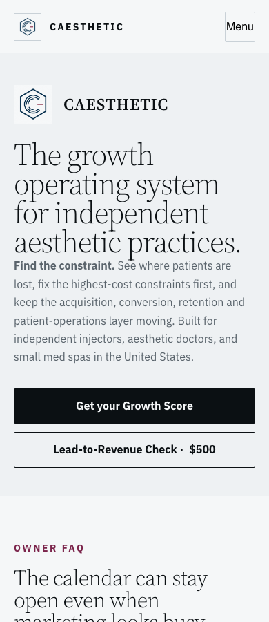
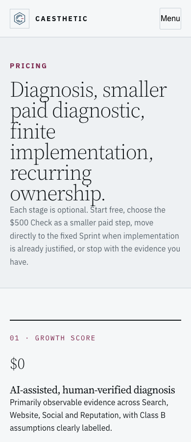
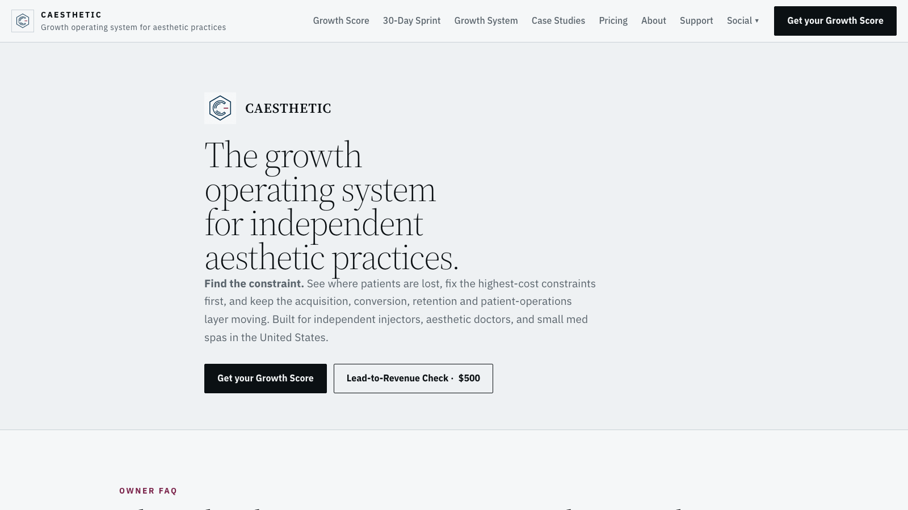

# CAESTHETIC design implementation — 2026-09-05

Source baseline: `196294d0e21e7a7586be9aef4d6e2e3538317a26`. Runtime implementation authorized by the owner in the same task as the design SSOT and implementation plan.

## Delivered changes

- DS-01/02: shared grid minimums, wrapping CTA labels, 14px shared small-type tokens, 16px actions/inputs and navigation. Checked for descendant clipping, not merely body scroll width.
- DS-03/04/05/06: identifiable salon footer links across four locales; labelled keyboard-scrollable report tables; valid filter group semantics; visible focus and adequate form borders. Navigation/dialog scroll lock and focus behavior remain tested.
- DS-07: preserved original logo files; dedicated 192px square and 640px long PNG delivery assets replace embedded-raster SVG use. Budgets are enforced. Field CWV is not inferred from byte savings.
- DS-08/09: initial HTML CSS loading, one shared font import, removed duplicate token import and verified undefined aliases; generators and output stay aligned.
- DS-10/11/12: branded Worker access/error shells preserving access/status/no-store semantics, repaired private estimate layout/contrast and private deck contrast, normalized shared report corner/shadow treatment. Warm report and isolated Spoken v2 profiles retained. All report JSON/evidence/commercial values and protected image originals unchanged.
- DS-13: local-only component fixture, registered page/profile coverage, static contract/rejection tests, browser checks and exact artifact acceptance. Required new-page registration; no public fake client gallery.

## Enforcement

`docs/caesthetic/design/README.md` documents the control path. New deviations fail; exact retained styles are limited by selector/rule/value/count and expire. These are migration/advisory entries, not a claim that every recorded literal or custom spacing is an accessibility defect. Removed entries must be pruned, so their return cannot silently pass.

Canonical origin and Worker scripts require an exact-SHA/runtime/SSOT/contract receipt. The old mutating Nogi workflow is retired; direct legacy cutover is blocked in favor of Deploy CAESTHETIC. The Agent API already dispatches that canonical workflow. Existing `publish-growth-score-deploy.sh` invocations without a receipt now fail closed; use the canonical workflow after publishing source.

GitHub returned 403 with a plan-upgrade requirement for private-repository branch protection/rulesets. No protection-against-admin or enabled-main-ruleset claim is made. Deployment controls are implemented; repository-level restrictions remain dependent on GitHub account capability.

## Validation and limitations

Local evidence records observations, engine, source identity and time. Earlier local runs can precede final documentation/contract changes; the release workflow repeats acceptance against the committed SHA. Successful conformance requires the release workflow, not stale local JSON. Chromium checks every route plus the local fixture; Firefox/WebKit cover representative families. Existing navigation/request tests cover keyboard/focus, dialog validation and multiple widths without real lead submissions.

The unmodified main baseline has 25 failing tests in the broader CAESTHETIC suite (commercial/copy/publication expectations). Those are recorded separately from this change; do not rewrite pricing or approved facts to make unrelated old expectations pass. Targeted renderer/privacy/design and navigation suites pass. Final release evidence is recorded below.

Automated checks do not certify complete WCAG compliance, field Core Web Vitals, every assistive technology, or successful production authentication/payment. Protected production screens and local source are distinct coverage. No production lead/payment/research action is performed by design QA.

## Detector disposition

`detector-summary.json` preserves every category. Existing exact values are inventoried in the contract. Small essential actions and actual clipping/contrast failures were fixed through rendered checks. Spacing/side-tab/section-number heuristics require semantic interpretation: ruled evidence ledgers, status hatching, meaningful numbering and locked artwork remain intentional. Historical handoff CSS is not an authoring authority. Third-party/historical private presentation styles remain scoped; their values cannot spread to new pages through a directory-wide exception.

## Public visual checks

## Production acceptance

- Deployed SHA: `c745ab4f0c9be378a6b90dbb923d5518ab0191c8`. [Canonical workflow 33978593096](https://github.com/zaomir/grainee-v2/actions/runs/33978593096): **success**. Production smoke: **PASS**, 2026-09-05T16:52:18Z.
- Exact-release CI: Chromium 171 observations (56 routes plus local component fixture at three widths), Firefox 24, WebKit 24; zero reported errors. `release-receipt.json` and `ci-summary.json` bind acceptance to runtime, SSOT and contract hashes.
- Production: 56 registered routes at 320/390/1440 = 168 observations, zero reported errors; see `production-browser.json`. Protected routes cover their anonymous access screens here; the canonical protected-score smoke separately passed its existing two-report access checks. No claim of authenticated content coverage for every private route.
- Independent public verification: home and pricing HTTP 200; token CSS, access CSS and both optimized logo assets match release bytes exactly (`independent-live.json`).
- `production-smoke.txt` preserves the canonical deployment record. This evidence/status-only follow-up does not alter deployed runtime and requires no additional deployment.
- Remaining work: retire reviewed legacy static exceptions before 2026-10-05; reconcile the 25 baseline failing tests with current commercial authorities; enable main branch rulesets when the GitHub plan permits. Manual assistive-technology review and field Core Web Vitals remain outside automated acceptance.
