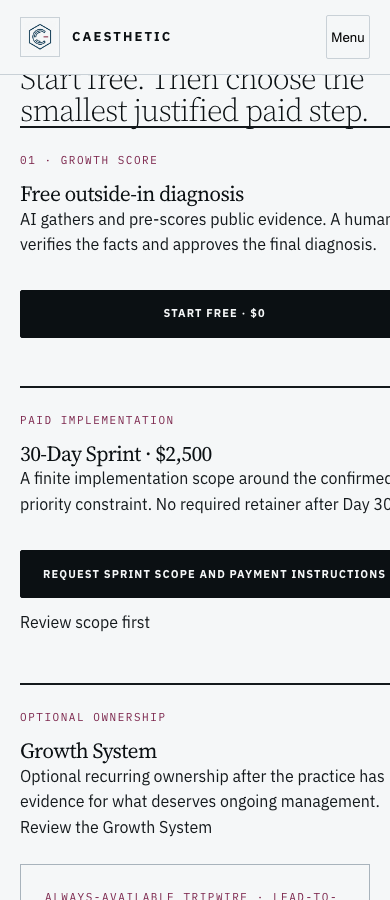
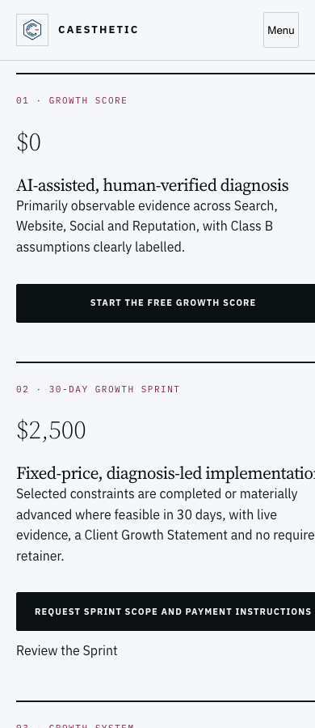

# CAESTHETIC — design conformance and remediation plan

Date: 2026-09-05. Scope: design canon consolidation and read-only review. Runtime implementation/deployment is not part of this task.

## Decision

Adopt `docs/ssot/CAESTHETIC_DESIGN_SYSTEM.md` v3.0.0 as the single visual authority. Retain three intentional surface profiles: cool marketing pages, warm standard owner reports, and the isolated Spoken v2 profile. Check500 and immutable illustrations retain their explicit contracts. Unification means one governed role system, not recoloring every approved artifact.

The site is **not fully conformant** with the canon. The highest-priority confirmed problem is mobile content/action clipping; the next work is shared readability, accessibility, cascade and asset delivery. Do not redesign pages individually before fixing the shared sources.

## Evidence and coverage

- Initial source snapshot: `a9676b80fb227ce35a824e652490a96edb6c9776`.
- Refreshed source snapshot: `5dad5f00ed2a1105a0542ff42841bdd612ec4374`. Concurrent header, scroll-lock, skip-link and localized-shell fixes were read and preserved. They are not work shipped by this task.
- 63 HTML sources inventoried: 56 route candidates and 7 templates/handoff/fragments. `PAGE_MATRIX.md` records every source; `inventory.json` records the refreshed scan.
- Every one of the 56 routes rendered in isolated Chromium at 320, 390 and 1440px. Initial/local-fallback run contains 219 observations; a second settled-load run replaces early data so asynchronous content is not mistaken for a blank page. Refreshed local-source checks add 51 observations across 17 routes in `refreshed-local-renders.json`.
- Two actual public case IDs were read from the public-cases endpoint and their detail pages checked at all three widths. After waiting for data, both resolved. A bare detail template with no ID is an error state, not a broken published case.
- Additional edge states: invalid Preview URL, protected intake guide and unknown route. `interaction-and-dynamic.json` records these, menu keyboard cycling/Escape and FAQ Enter.
- All 16 current sitemap URLs are included. There may be credentialed/token-specific states not enumerated by source/sitemap; no valid private Preview token, authorized payment order or session was created or guessed.
- Automated axe-core checks cover 66 page/mode combinations at 390px. `axe-results.json` includes violations and manual-review/incomplete categories. Zero violations on a route is NOT a WCAG certificate.
- `live-css-fingerprints.json` records initial byte comparisons; `live-css-final.json` records the refreshed comparison. Do not infer a whole-site deployed SHA from seven matching CSS files.
- No real form submission, payment, report publication, research, score change or customer message was performed. Protected pages were not unlocked. Local source review is distinguished from the production access screen.

The Aside supplementary attempt could not reliably expose rendered/screenshot output and is not used as visual-pass evidence. The decisive rendered evidence uses the repository's existing Chromium/Playwright QA runtime. Screenshots were inspected for representative composition and clipping; per-route geometry/DOM checks cover the complete inventory. This is not an exhaustive manual screen-reader or cross-browser certification.

## Findings and concrete fix plan

| ID / priority | Evidence / impact | Source to change | Acceptance |
|---|---|---|---|
| DS-01 / P1 | Main, About and Pricing steps overflow at 390px: article is about 389px wide inside a 350px container; x=20 makes its right edge exceed the viewport. Text and CTA are visibly cut while body overflow is clipped. Similar mobile flags exist on salon locales, especially FR/RU. | `assets/css/growth.css` `.cae-steps-3/.cae-step`, `caesthetic.css` `.cae-btn`, locale layout rules in `beauty-salons.css`; change the shared/generator source, not individual output text. | Content-driven min-width:0/minmax(0,1fr), wrapping action labels and safe gutters. Every affected page passes 320/390/430 plus 200% text; no loss hidden by overflow-x:clip. Screenshot comparison includes full CTA labels. |
| DS-02 / P1 | Essential UI still uses 11px uppercase text; 30 source pages initially inherit the legacy action pattern. Rendered evidence confirms small labels/actions on core funnel and localized pages. | `tokens.css`, `caesthetic.css`, `growth.css`, `beauty-salons.css`, relevant renderer classes. | Essential metadata ≥14px, action/input text ≥16px; 44px targets/48px button height; wrapping without loss. Preserve exact locked copy, prices and scoped report typography. Re-test the increased text because it can expose further overflow. |
| DS-03 / P1 | Axe: salon footer email link distinguished only by color (2.21:1 against surrounding text), on EN/ES/FR/RU. | `salon-funnel-copy.js` / `beauty-salons.css` footer link treatment. | Persistent underline or another adequate non-color cue; all four locales pass the specific rule. This is link identification, not a claim that the link fails contrast against its background. |
| DS-04 / P1 | Axe: `.cae-network-focus-decision > .cae-table-scroll` is not keyboard-focusable in the demo Multi-Location parent. | Report generator and `growth-report*.css`/cockpit behavior. | Keyboard can enter and horizontally scroll the labelled comparison region. Tables stay legible, focus children remain navigation-only, no extra CTA or data change. |
| DS-05 / P2 | Axe: `.cae-active-filters` has aria-label on an unsupported generic div in Case Studies. | `case-studies/index.html` or its builder and `case-studies.js`. | Use correct semantic group/region and an accessible label, or remove unnecessary ARIA; filter chips still announce meaningful state. |
| DS-06 / P1 review, P2 migration | Standard field border on paper is 1.44:1; border-data is 1.99:1. This is valid for decorative separators but potentially inadequate when the boundary alone identifies a control. Current focus shadow also needs composited contrast review. | Shared input/control border and focus tokens in `tokens.css`/`caesthetic.css`. | Identify all contexts where boundary is necessary; use ≥3:1 there, retain quiet rules for layout. Test default/focus/error/disabled states on light, warm and dark surfaces. Do not indiscriminately darken every divider. |
| DS-07 / P1 performance investigation | Square logo SVG 3,703,234 bytes; square PNG 2,370,017; long SVG 8,034,931; long PNG 473,425. SVGs embed raster payloads. Small header mark is served from a multi-megabyte asset. | Brand asset delivery, templates/header/footer and media manifest. | Produce an authorized optimized delivery asset retaining appearance/proportions/provenance; compare actual transferred bytes and LCP before/after. Do not redraw or silently replace the logo. Do not apply this optimization to immutable report PNGs. No CWV failure is claimed without field data. |
| DS-08 / P2 | 34 sources initially load `caesthetic-config.js`, which appends visual styles after initial HTML. Duplicate tokens.css imports, remote font import and scattered override files make first paint/cascade fragile. | Templates/build pipeline, `caesthetic-config.js`, `caesthetic.css`, font loading. | Deterministic initial CSS order, one font-delivery path, only loaded weights; no first-paint style jump, no-JS content remains usable. Maintain Check500/report/Connect4 scope. |
| DS-09 / P2 | Shared/report code references undefined token candidates; private estimate templates retain removed pink/magenta/glow/gradient tokens. | `growth-report-base.css`, `growth-report.css`, `growth.css`, `pay/index.html`, private estimate styles. | Resolve each candidate against its real loaded/JS token scope. Replace genuinely undefined legacy tokens with semantic roles; preserve functional runtime variables such as data-driven score values. No mass literal replacement. |
| DS-10 / P2 | Access/error shells use system-ui/Georgia, large radii/shadows or bare Times content rather than the shared brand system. Two protected/unpublished report URLs intentionally return a minimal 404 without html lang. | `infra/cloudflare/router/src/index.ts` access/error renderers and private gate templates. | Accessible branded password/error/expired states, correct lang/viewport/main, usable focus and recovery; preserve status codes, no-store/noindex and access policy. Do not make a private report public to fix its appearance. |
| DS-11 / P2 | Private legacy estimates and deck use independent styles; estimate has undersized controls and 320px overflow; deck subtitle measured 4.38:1 against 4.5:1 requirement. | Private template sources and deck stylesheet. | Migrate presentation only; preserve signed/approved numbers and client content. Explicit private profile or shared canon, sufficient contrast and targets. Do not recreate historical commercial terms. |
| DS-12 / P2 | Standard report CSS has gradients, rounded/pill surfaces, synthetic weights and dense metadata inconsistent with the consolidated rule system; immutable graphic lettering becomes small at phone width. | Report style layers and generator; existing locked-image contract. | Remove unnecessary chrome while retaining approved warm palette, nine-section structure and data. Add separately accessible textual explanation where contract permits; never crop/redraw/translate/overlay the locked image. A table inside a labelled horizontal scroll region is not a failure merely because its internal width exceeds the screen. |
| DS-13 / P2 | No complete CAESTHETIC production UI Kit was found; reusable states and exceptions are distributed across CSS and pages. | One private/local UI Kit and conformance harness, after shared fixes. | Representative marketing, standard report, Spoken v2, Check500, Connect4, form/gate/table states; visible tokens and scoped variants, responsive/keyboard/contrast regressions. No public fake proof gallery. |

### Recommended delivery sequence

1. **Shared mobile repair:** DS-01 and the wrap/min-width part of DS-02. Owner: frontend engineer + UX. Start with Home/Pricing/FR salon as representative surfaces; then all matching instances. Ship only after full affected-route checks.
2. **Accessible component pass:** DS-02–06. Owner: frontend + accessibility reviewer. Keep confirmed menu/FAQ behavior, increase essential type, fix link/ARIA/table issues and test overlays/keyboard/form states with intercepted requests.
3. **Brand delivery and architecture:** DS-07–09. Owner: frontend/performance engineer + brand owner for source provenance. Consolidate CSS/fonts and reduce authorized logo payload. Verify no-JS and first paint, then field-monitor CWV.
4. **Report/private/state families:** DS-10–12. Owner: report renderer engineer + UX. Migrate generators and shared templates, regenerate only intended versions; compare immutable assets and approved report data hashes before/after. Review access/payment/Preview success paths using an authorized fixture/session, never a guessed token.
5. **Prevent recurrence:** DS-13. Owner: design systems + QA. Add representative screenshots, Chromium/WebKit/Firefox coverage, text resize/spacing tests and per-route source/profile mapping. Use the matrix as the acceptance checklist.

No fixed delivery estimate is asserted before checking the generator/dependency scope. Each batch ends with applicable tests, main, canonical deploy, deployed SHA and production smoke; a documentation merge alone does not complete runtime remediation.

## Per-family assessment

- **Core funnel:** recognizable brand palette/type; mobile steps and essential-action readability need repair. Growth Score form and public product shells were rendered; paid/order success states not exercised.
- **Connect4:** strongest current reference for readable 16–18px UI and explicit mobile artwork. Zero overflow candidates at tested widths; keyboard FAQ Enter passed. Keep its approved PNG pairs and the narrative hierarchy.
- **Salon locales:** shared design present; footer link identification and narrow-width content need correction across all locales, not English alone.
- **Case Studies:** library/filter semantics need repair; two actual API-backed detail pages resolve after data loading. Bare `/case-studies/case/` is tested as the missing-ID state.
- **Standard reports:** preserve warm palette and evidence-first hierarchy; inspect local scroll regions separately from body clipping. One confirmed keyboard-scroll violation in Multi-Location demo. Parent/focus-child distinctions remain intact.
- **Spoken v2:** 14/18/32px profile is a useful readable reference; its wide table is inside `.v2-table-scroll`, not an automatic body-overflow defect. Do not retroactively convert every report to v2 in a CSS cleanup.
- **Protected reports/private pages:** production access screens and available local source were reviewed separately. Some local sources are also gated shells; their hidden payload/success state remains NOT_ASSESSED. Preserve access controls.
- **Legal:** no overflow candidates in this three-width run; no claim of complete accessibility/legality certification. Shared font/cascade changes still require regression coverage.
- **Redirects/fragments:** retained in inventory for completeness; they do not need separate marketing redesigns.

## Detector triage

Impeccable detect exited 2 with 1,656 findings (1,650 active-source and 6 handoff findings). These are heuristic occurrences, **not 1,656 confirmed defects**. Most `cramped-padding` results do not account reliably for nested wrappers/tokenized inset. Every category is triaged below; detailed occurrences are in `impeccable-findings.json`.

| Categories | Disposition |
|---|---|
| undersized-ui-text, tight-leading, wide/extreme-negative tracking, all-caps-body | DS-02/12; verify actual computed style and reading context |
| clipped-overflow-container | DS-01/04/12; distinguish body clipping from intentional labelled local scrolling |
| low-contrast | DS-03/06/11; use computed/axe findings, not a literal-color guess |
| gradient-text, dark-glow, ai-color-palette, gpt-thin-border-wide-shadow, overused-font, nested-cards, hero-eyebrow-chip, pulsing-dot, layout-transition | DS-08–12; remove legacy ornament unless a scoped contract actually requires it |
| cream-palette | Standard warm report/Check500 is an intentional scoped exception; not a marketing-default change |
| side-tab, numbered-section-labels | Semantic priority markers and report references are intentional; repeated decorative use is reviewed under DS-12. Never delete evidence/navigation IDs to satisfy a heuristic |
| cramped-padding, monotonous-spacing, kicker-above-heading | Manual layout review; wrapper/token false positives are not auto-fixed; DS-01/12 for confirmed cases |
| skipped-heading, broken-image | Verify rendered loaded state; hidden templates/lazy media are not automatically missing; preserve in per-page review backlog |
| em-dash-overuse, aphoristic-cadence | Editorial advisory, outside runtime design mutation scope; no unauthorized rewrite of approved client/locked copy |

## Remaining verification limits

Not assessed: field CWV, exhaustive manual screen-reader navigation, full Safari/Firefox matrix, all text-resize/spacing variants, authenticated successful private Preview/payment/session states, server-side business rules. These are explicit acceptance work in the plan, not hidden PASS claims. A complete sitewide WCAG conformance declaration is not supported by this review.

Local screenshot artifacts are retained outside the repository. Only a few public/synthetic evidence crops may be included; private full-report images and customer content are not copied into this report. No production deployment was performed by this task.

## Visual evidence

Public mobile crops show the confirmed shared-step clipping at 390px. Private report screenshots are deliberately not included in this repository evidence.

