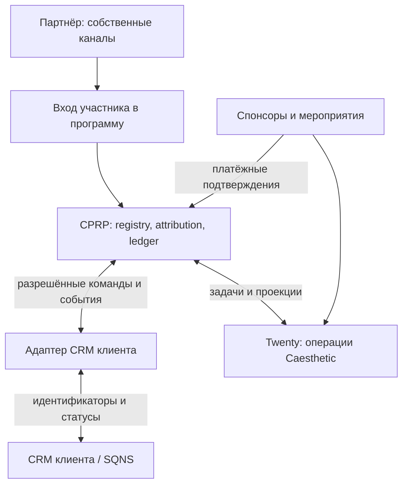

# CPRP — бизнес- и системная архитектура

Authority: [master](../../ssot/CAESTHETIC_PARTNER_REVENUE_PLATFORM.md). Проектирование v1; runtime пока не реализован.

## Роли и договорные связи

| Роль | Ответственность | Коммерческая связь |
|---|---|---|
| CAESTHETIC | Подбор/подключение партнёров, программа, координация, данные, отчёты, организация событий | Мандат и SOW с клиентом; соглашение о программе с партнёром; договор участия со спонсором |
| Клиент | Продукт, цена, доступная ёмкость, запись, оказание услуги, касса, возвраты | Оказывает услугу конечному получателю; платит CAESTHETIC по Schedule |
| Audience partner | Размещения, eligibility, аудитория, контакт по программе | Предоставляет benefit своей аудитории; может покупать пакет абонементов |
| Спонсор / экспонент / дополнительный провайдер | Конкретное участие и оплаченный пакет | Платит CAESTHETIC за организацию/инвентарь; может отдельно быть клиентом платформы |
| Координатор CAESTHETIC | Переговоры/задачи по назначению, exceptions, исполнение event brief | Назначение и backup; отношения и переписка принадлежат рабочему процессу компании |
| Участник программы | Самостоятельная регистрация, выбор обращения, возможная рекомендация | Условия программы и услуги конкретного поставщика |

Мандат определяет страну, отрасль, целевые сегменты, утверждённые benefits, пределы скидок/расходов, право переговоров и подписания. Он не означает право принимать медицинские решения или произвольно обязывать клиента.

Один банк может участвовать в нескольких клиентских программах. Сначала применяется география/аудитория/продуктовая релевантность, затем доступная ёмкость, договорные ограничения и конфликт интересов. Выбор клиента фиксируется до отправки предметного предложения.

## Подсистемы

**Twenty:** компании, B2B-контакты, partner opportunities, обязательства, договорные ссылки, задачи, календарь активаций, события, exceptions, агрегаты и статусы settlement.

**CPRP registry:** programs, client/market bindings, enrollment, eligibility, referral lineage, rules versions и согласия. Прямые контакты вынесены в restricted identity boundary.

**Integration adapter:** нормализация, mapping, очередь, идемпотентность, сверка. Не даёт Twenty редактировать клиническую карту.

**Ledger:** неизменяемые payment allocations, fee accrual, corrections, settlement, evidence references. Это финансовый subledger, не полная бухгалтерия и не платёжный процессор.

**CRM клиента:** lead/contact/patient, appointments, visits, оказание услуги и исходные документы. Оплата подтверждается клиентской финансовой системой/кассой; если CRM не источник денег, подключается финансовый feed с той же lineage.

Пилот можно реализовать как модули существующей инфраструктуры, один worker и региональное хранилище. Микросервисы, real-time dashboard и marketplace не являются условием запуска.

## Изоляция

- `client_id` обязателен для enrollment, CRM links, revenue и задач по конкретному клиенту; `market_id` и `program_id` не выводятся из IP/валюты.
- Глобальный directory хранит организацию и публичные B2B-факты; коммерческие условия программы и участники изолированы.
- Доступ сотрудника = назначенная роль + разрешённые клиенты/рынки/программы. Фильтр интерфейса не считается контролем доступа.
- Если установленный Twenty не обеспечивает нужное ограничение записей, используем отдельные workspaces/instances; интеграционный слой всё равно проверяет tenant scope.
- Один логический коммерческий слой допускает отдельные физические хранилища по странам.
- Отказ Twenty не блокирует обращение пациента, клиентскую кассу или сохранение финансового события. После восстановления проекция догоняется из очереди.

## Не создавать преждевременно

В документации предусмотрены regional deployment и новые CRM adapters, но нет обещания готовности. Сначала одна воспроизводимая цепочка «партнёр → участник → CRM → оплата → сверка» и ручной обработчик exceptions. Затем масштабирование по доказанной contribution.
