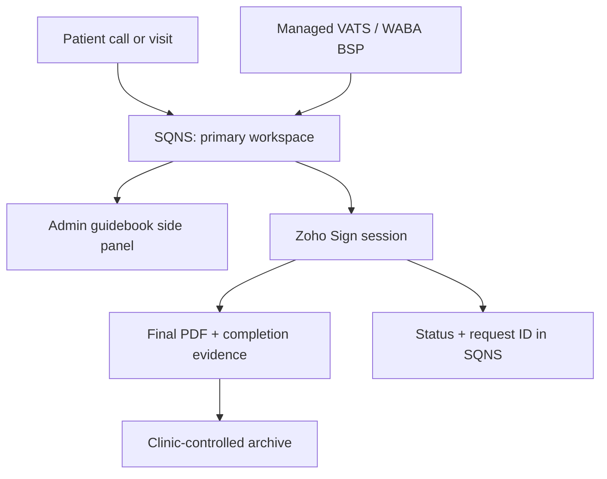

# Expert Dental — infrastructure and CRM SSOT

This document is the single cross-system source of truth for the clinic's CRM, telephony, administrator prompts, electronic signing, evidence storage, privacy gates and pilot rollout.

## 1. Authority and scope

When documents conflict:

1. this file governs the clinic-wide architecture, system boundaries and pilot scope;
2. the approved legal package governs the exact wording and activation status of legal forms;
3. `ADMIN_GUIDEBOOK_SSOT.json` governs administrator scripts and training content;
4. `EXPERT_DENTAL_OMNICHANNEL_COMMUNICATIONS.md` is the subordinate detailed communications design;
5. vendor capabilities not confirmed in official documentation or in writing remain `VENDOR GATE`.

This SSOT must remain reusable: clinic-specific values are configuration, while system roles, data boundaries, evidence requirements and gates form the reusable pattern.

## 2. Confirmed operating context

| Item | Current fact |
|---|---|
| Clinic | Expert Dental Studio, Bishkek |
| Primary MIS/CRM | SQNS, already in daily use |
| Users | 10 doctors, 5 administrators |
| Internal technical staff | none; implementation must be supportable by SQNS staff and ChatGPT-assisted configuration |
| Staff operating maturity | low; workflows must be short, explicit and hard to misuse |
| Patient signing | one managed tablet in the pilot |
| Legal forms | exact 27-form baseline approved by local counsel as owner-reported on 2026-08-30; medical, licence, credential, provider and activation gates remain where recorded |
| Tunduk | out of scope |

## 3. Binding architecture principles

1. **SQNS is the primary CRM/MIS and daily workspace.** Do not create a parallel patient CRM.
2. **Buy managed infrastructure; do not build a call centre platform.**
3. **The pilot uses manual, visible steps.** Automation is added only after the manual route is stable.
4. **One datum has one owner.** Links and IDs may be copied; clinical records are not duplicated.
5. **No PHI in the guidebook, ChatGPT or general-purpose operator surfaces.**
6. **Legal evidence is separate from clinical workflow.** SQNS shows status and identifiers; the signing provider and clinic archive retain evidence.
7. **Every unconfirmed integration is a gate, not an assumption.**
8. **Administrators do not make clinical or legal decisions.** They identify, route, verify and record.

## 4. Target system map

| Layer | Selected system | Responsibility |
|---|---|---|
| Clinical CRM/MIS | SQNS | patient, doctor, visit, schedule, card/history, categories, treatment workflow, services/payments, native caller popup and call log where supported |
| Ordinary voice | Beeline Kyrgyzstan managed VATS/SIP candidate | +996 numbers, queues, routing, recording, call metadata |
| SQNS telephony bridge | native SQNS / «Простые звонки» | caller recognition, native popup, call-to-patient association; exact compatibility is a vendor gate |
| WhatsApp | official WABA/BSP; Infobip preferred candidate, Twilio alternate | messages and WhatsApp Business Calling; calling must terminate to SIP/PBX for recording |
| Administrator prompts | guidebook SSOT + browser side panel pilot | compact scripts without patient data; future native SQNS placement is a vendor gate |
| Electronic signing | Zoho Sign preferred pilot; DocuSign fallback | templates, live patient/doctor signing, final PDF, completion evidence |
| Clinic evidence archive | clinic-controlled repository, design/retention gate | independent export, retention, legal hold, recovery and vendor exit |
| Configuration assistant | ChatGPT | maintain SSOTs, checklists, templates and vendor questions; never patient system of record or live free-form clinical answer engine |

Target deployment:

There is no additional CRM, custom communication router, custom caller popup or custom PBX in the pilot.

## 5. Data ownership matrix

| Data object | System of record | Allowed downstream copy |
|---|---|---|
| Patient identity and contacts | SQNS | minimum fields entered into a signing request; no copy into guidebook |
| Doctor identity | SQNS | name/role in signing request |
| Visit, schedule, services, treatment status | SQNS | visit reference in signing request if needed |
| Clinical record, diagnosis, dental chart, treatment plan | SQNS | only exact approved fields needed by a legal template |
| Call event and patient association | SQNS after telephony bridge | PBX call ID/link and disposition |
| Call audio | PBX/VATS or WABA voice layer | controlled evidence export; SQNS link/ID only unless vendor contract says otherwise |
| Administrator scripts | `ADMIN_GUIDEBOOK_SSOT.json` | generated web, print and training views |
| Legal template text | approved legal package / signing template register | rendered signing request |
| Signing request, final PDF, completion certificate | Zoho Sign in pilot | independent clinic-controlled export/archive |
| Legal hold and evidence package | clinic-controlled archive | authorised evidence export only |
| Passwords and service credentials | managed secret/account controls | never in shortcuts, guidebook or repository |

## 6. Minimal administrator workflow in SQNS

### 6.1 Incoming call

The administrator works in SQNS. The native caller popup should show the caller and available patient history. The administrator:

1. identifies the patient or creates the minimum new-patient record;
2. opens the patient/visit in SQNS;
3. uses one guidebook intent card if needed;
4. books, changes or routes the request;
5. records one call outcome in SQNS.

The guidebook is advice; SQNS remains the place where the action and outcome are recorded.

### 6.2 Canonical call outcomes

Keep the list short:

- `Записан / визит изменён`;
- `Перезвонить`;
- `Передано врачу`;
- `Отказ / неактуально`;
- `Не дозвонились`;
- `Ошибка / дубликат`.

Do not duplicate the outcome in the guidebook or another CRM.

### 6.3 Funnel

Do not impose a long sales funnel on the pilot. The only required conversion milestone is:

- `Лечение начато`.

Appointment state and call outcomes are operational facts in SQNS, not additional funnel stages.

### 6.4 Proposed pilot SLA

Status: `PROPOSED_PILOT_POLICY`, requiring clinic-owner confirmation.

- missed call: callback within 5 minutes during working hours;
- a question requiring clinical judgement: route to a doctor;
- administrator must not improvise diagnosis, treatment guarantees or medical advice.

## 7. Guidebook inside the administrator workspace

### 7.1 Pilot

Use SQNS full-screen with a pinned browser side panel on each of the five administrator computers. The panel:

- displays content generated from `ADMIN_GUIDEBOOK_SSOT.json`;
- has six top-level intents: booking/transfer, price, fear/doubt, pain/post-treatment, complaint, urgent/doctor;
- renders each card as `Скажите / Уточните / Сделайте / Не говорите`;
- does not read the SQNS DOM;
- does not receive patient data;
- does not require SQNS API access;
- never generates a free-form clinical answer.

The existing `/render/` interface remains the runtime source, training/print view and fallback, but not a second CRM.

### 7.2 Future native placement

A button, iframe, side widget or contextual panel inside the SQNS call popup, schedule or patient card is `VENDOR GATE`. Public SQNS materials confirm native telephony UI, but do not confirm arbitrary third-party UI embedding.

Aura may use approved scripts for written messenger conversations if the vendor confirms controls. It is not assumed to be a live telephone copilot.

## 8. Telephony and WhatsApp

### 8.1 Required capacity

The requirement is:

- five administrator operator seats;
- at least five concurrent call legs, subject to measured traffic;
- one headset/workplace per active operator;
- the number of public phone numbers and WABA senders is configured separately.

This does **not** mean five independent brands, business identities or CRMs.

### 8.2 Ordinary calls

Preferred pilot path:

`+996 number → managed Beeline VATS/SIP → native SQNS/«Простые звонки» bridge → SQNS popup and log`.

Vendor confirmation is required for +996 formats, existing numbers, queues, recording, five simultaneous operators, call IDs/links and SQNS matching.

### 8.3 WhatsApp

Use the official WhatsApp Business Platform through a BSP. Infobip is the preferred candidate; Twilio is a valid alternate.

For recorded WhatsApp calls:

`WhatsApp Business Calling → BSP → SIP/PBX → operator headset + recording`.

WAHA cannot be the recording layer for WhatsApp calls and is not the target production transport. It may remain only as temporary/test/legacy messaging until removed.

### 8.4 Recording

- PSTN recordings remain in the contracted PBX/VATS.
- WhatsApp call recordings remain in the SIP/PBX/CPaaS voice layer.
- SQNS stores metadata, patient association and a protected link/ID if supported.
- notification/consent, access, retention and deletion rules are legal/privacy gates.
- transcription, summarisation and quality scoring are a later phase, not the pilot.

## 9. Electronic signing

### 9.1 Pilot model

Zoho Sign is the preferred pilot because the clinic needs a simple template-driven in-person flow; DocuSign is the fallback if Zoho cannot meet identity, in-person signing, audit, export, retention or regional requirements. Commercial terms and live capabilities must be reverified before purchase.

SQNS does not generate documents for Zoho. The administrator takes only the required patient, visit and treating-doctor field values from SQNS and enters them into a controlled Zoho template using `Use Template`. SQNS-to-Zoho automatic transfer is a later `VENDOR GATE`.

### 9.2 Tablet and identity

- one managed iPad;
- one icon: `EXPERT SIGNING DESK`;
- one technical signing-desk account on the managed device;
- no passwords embedded in shortcuts;
- the acting administrator must be selected or otherwise recorded separately for audit;
- session lock, MFA/recovery and device-loss process are required.

### 9.3 Roles and template classes

| Class | Live signers | Clinic-side baseline |
|---|---|---|
| A1 — contracts | patient or representative | clinic requisites and approved authorised signature/seal already present; never patient data |
| B2 — clinical consents | patient or representative + doctor | clinic requisites present; doctor signs personally only where the form requires it |

The current pilot register contains four A1 contracts and three B2 consent templates. The administrator signs neither class.

“Pre-signed by the clinic” means only that approved clinic requisites and, where legally authorised, the clinic-side signature/seal are already in the template. Patient-specific fields are completed for each request.

### 9.4 Signing session

1. administrator selects the approved template;
2. copies minimum patient and treating-doctor data from SQNS;
3. checks identity and representative authority;
4. gives the tablet to the patient to read and sign;
5. where required, the doctor signs personally in the presence of the patient and administrator;
6. administrator checks only technical completeness;
7. Zoho completes the request and produces final evidence;
8. SQNS receives `signed/voided`, Zoho Request ID and completion date;
9. evidence is exported to the clinic-controlled archive.

Administrator prohibitions:

- do not sign for the clinic, patient, representative or doctor;
- do not reuse a saved doctor signature image;
- do not choose risks or provide clinical explanation instead of the doctor;
- do not edit a PDF after the first signature;
- if data is wrong, void the request and create a new one.

### 9.5 Evidence

Retain:

- final signed PDF;
- Zoho Completion Certificate / audit trail;
- template ID and version;
- request ID, timestamps, signer events and delivery status;
- evidence of copy delivery to the patient where applicable.

Zoho storage alone is insufficient for long-term resilience. Production requires an independent clinic-controlled export/archive with retention, integrity checks, legal hold, restore test and vendor-exit procedure.

## 10. Security, privacy and access

- five named administrator accounts and ten named doctor accounts in SQNS;
- least privilege; administrators do not see unnecessary salary/finance data;
- shared credentials are prohibited except the explicitly controlled tablet service identity, with per-admin attribution;
- no PHI in ChatGPT prompts, guidebook telemetry, browser side-panel storage, analytics or marketing CRM;
- protected links require authentication and access logging;
- vendor DPA, subprocessors, hosting countries, cross-border transfers, deletion/export, breach SLA and exit portability must be documented;
- SQNS states that user content and encrypted backups are hosted in Russia: cross-border transfer of Kyrgyz medical data and call recordings is a `LEGAL/PRIVACY GATE`;
- call recording requires approved notification text, access roles and retention schedule.

## 11. Pilot rollout

| Phase | Scope | Exit criterion |
|---|---|---|
| 1. SQNS baseline | roles, native caller popup/log, short outcomes, missed-call ownership | five admins can complete calls without a second CRM |
| 2. Guidebook panel | pinned side panel, manual intent, no API/PHI | scripts used reliably; outcomes remain in SQNS |
| 3. Signing pilot | Zoho `Use Template`, one iPad, A1/B2 register, manual fields | 30–50 sessions; final PDF and certificate exported; errors logged |
| 4. Voice proof | one ordinary number and one WABA call path end-to-end | caller ID, recording, retrieval and consent process verified |
| 5. Supported automation | only vendor-confirmed SQNS button/API/webhooks and minimal-context transfer | documented contracts, rollback and audit trail |

Do not roll out all numbers, templates or automation before the relevant proof passes.

## 12. Gates

| Gate | Required proof | Status |
|---|---|---|
| SQNS native guidebook placement | written confirmation of button/iframe/widget/context support | OPEN — VENDOR GATE |
| SQNS API/webhooks/deep links | documented scopes and test tenant | OPEN — VENDOR GATE |
| SQNS ↔ Zoho field transfer | supported API/no-code path and auditability | OPEN — VENDOR GATE; manual fallback approved for pilot |
| +996 VATS/SIP and SQNS matching | provider test with clinic number and five operators | OPEN — VENDOR GATE |
| WABA Calling → SIP/PBX | BSP confirmation and recorded test call | OPEN — VENDOR GATE |
| Cross-border SQNS processing | Kyrgyz legal/privacy review and patient notice basis | OPEN — LEGAL/PRIVACY GATE |
| Call recording | notice/consent, retention and access policy | OPEN — LEGAL/PRIVACY GATE |
| Signing provider | DPA, regions, evidence export, deletion, audit, tablet flow | OPEN — PROVIDER GATE |
| Clinic evidence archive | retention, integrity, restore, legal hold and exit test | OPEN — INFRASTRUCTURE GATE |
| Form activation | legal package approval plus medical/licence/credential evidence recorded per form | PARTIAL; see legal package |
| Administrator readiness | five named accounts, short SOP test, supervised first sessions | OPEN — OPERATIONS GATE |

No gate may be silently converted into a product claim.

## 13. Pilot metrics

Measure a small set only:

- missed-call recovery within SLA;
- call-to-appointment conversion;
- consultation show-up;
- treatment started;
- unsigned-document rate;
- signing request void/reissue rate;
- percentage of completed requests with PDF + completion evidence exported;
- call-record retrieval success;
- administrator attribution completeness.

## 14. Explicit non-goals

Do not build for the pilot:

- another CRM or lead card;
- duplicate schedule, patient card, dental chart, finance or general WhatsApp CRM;
- custom PBX, communication router, call board or caller popup;
- DOM scraping of SQNS;
- a generative AI answer engine during live calls;
- real-time transcription/QA;
- automatic SQNS-to-Zoho integration before vendor support is proven;
- storage of patient data in the guidebook;
- signature images for reuse.

## 15. Vendor correspondence ledger

Requests were sent on 2026-08-30 from the clinic contact mailbox:

| Vendor | Topic | Status |
|---|---|---|
| SQNS | embedding the administrator guidebook in call/workspace UI | awaiting response |
| SQNS / F.Doc | patient/document data flow and signing options | awaiting response |
| «Простые звонки» | +996, VATS/SIP, caller matching, events and recordings | awaiting response |
| Beeline Kyrgyzstan | external SIP/VATS and clinic onboarding | vendor asked for company/client context; clinic replied |
| Infobip | WABA Calling to SIP/PBX and recording | awaiting response |
| Zoho Sign | in-person template pilot, roles, evidence and integration | awaiting response |

Vendor answers must update this SSOT, the relevant subordinate SSOT and the gate status. No email answer changes production configuration by itself.

## 16. Reusable clinic pattern

For another clinic, preserve the architecture and replace only:

- primary MIS/CRM;
- country, privacy and medical-law gates;
- telephony/BSP providers;
- staff counts and concurrency;
- legal templates and signer-role matrix;
- retention periods and evidence repository.

The reusable invariant is:

`primary clinical MIS + managed communications + read-only script layer + specialised signing/evidence layer + explicit vendor/legal gates`.
