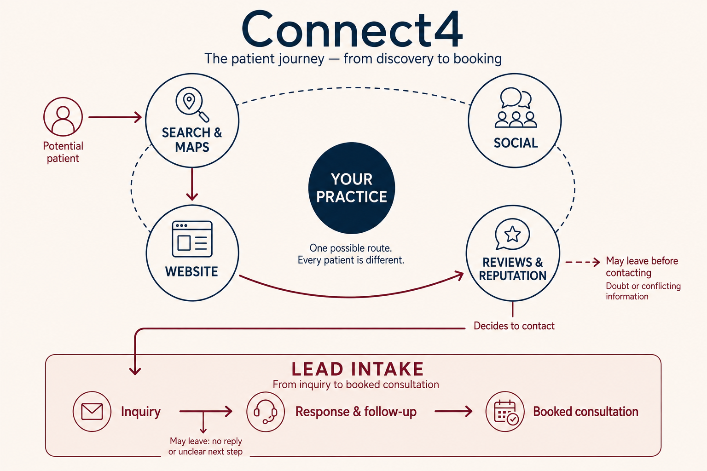

# Connect4 — концепция и единое объяснение

<a id="connect4-routing"></a>

## 0. Канонический маршрут для любой сессии и формата

**Connect4 / 4444 / Четверки / Четвёрки → этот документ на актуальном `zaomir/grainee-v2/main`.** Это один продуктовый смысл, а не четыре разных программы. Публичное имя — только **Connect4**. Упоминания «Как мы работаем», «Кто мы и что делаем», «маркетинговая основа», полная страница, короткая секция, схема или объяснение Connect4 также направляются сюда в контексте этой программы.

| Задача | Канонический раздел |
|---|---|
| Название, определение, ценность, короткое объяснение | [§10.3 — единое ядро](#connect4-definition) |
| Термины для разных ниш | [§10.2 — словарь](#connect4-vocabulary) |
| Пошаговая работа и передача | [§10.5 — этапы](#connect4-delivery) |
| Подробная страница | [§10.6 — landing](#connect4-landing) |
| Одна секция для Кейсов и отчётов | [§10.7 — reusable section](#connect4-section) |
| Картинки, desktop/mobile и значения линий | [§9 и §10.8 — визуалы](#connect4-visuals) |
| Версии, изменения, производные публикации | [§10.9 — повторное использование](#connect4-reuse) |

Порядок authority: глобальные marketing/communication/evidence стандарты → `CAESTHETIC.md` для продукта, цены и воронки → этот SSOT для объяснения и его форматов → конкретный материал. Метод исследования остаётся в `CAESTHETIC_4444_CONSISTENCY_STANDARD.md`. Не восстанавливать определение из номера 4444, старого чата или устаревшего зеркала. Если доступен только `zaomir/caesthetic`, читать тот же путь на его актуальном main, указывать фактически доступную версию; это зеркало/authoring surface, не новая authority.

Маршрутизация не требует вставлять весь лендинг при каждом упоминании. В коротком ответе используется определение; подробный ответ раскрывает то же ядро. Она не запускает исследование бизнеса, пересчёт отчёта, публикацию или deploy сама по себе и не меняет действующие правила работы с конкретным кейсом.

## 1. Статус и границы authority

Этот документ — единый подробный источник описания концепции Connect4 для объяснения продукта, раздела «Как мы работаем», отдельной страницы и переносимой секции. Он развивает master `CAESTHETIC.md` §2, а не заменяет его коммерческие и доказательные правила.

**Решение владельца от 2026-09-05T13:03:25Z: «согласен. оформи SSOT и роутинг к нему».** Согласованная редакция v1.5 повышена до действующего канона объяснения v1.6: нейтральный словарь, смысловое ядро, EN/RU base copy, этапы, подробная страница, переносимая секция, принципы чередования текста и визуалов. Контракт — `connect4-explanation/1.0.0`. Эти блоки больше не являются свободными конкурирующими draft-вариантами; последующие изменения оформляются в этом же документе с новой версией и основанием.

Семантические решения в §2–7 закреплены для CAESTHETIC: четыре плоскости, согласованность, один ответственный, честные отзывы, отдельный Lead Intake, позднее объяснение рекламы, различение внедрения и эффекта. Клиника/пациент в этих операционных разделах — отраслевой контекст CAESTHETIC, не обязательный словарь общего объяснения. Для новых общих описаний применяется §10.2: бизнес, потенциальный клиент, обращение, клиент, следующий шаг. Это не меняет клиническую терминологию, факты существующих кейсов, ICP или договоры.

**Утверждение объяснения не равно публикации сайта.** `/connect4/` — предусмотренный адрес будущей подробной страницы, не выпущенный этим решением URL. Приняты архитектура и базовые формулировки; конкретные новые изображения, их нейтральные редакции, точная вёрстка, runtime-модуль и миграция публикаций остаются отдельной реализацией. Точные уже утверждённые изображения §9.1–9.3 сохраняют свои независимые контракты. Исследовательские цифры §10.4, гипотезы болей и будущий пилот не становятся проверенным эффектом от согласия с концепцией.

Метод исследования, десять фраз, матрица 10 × 4 и статусы доказательств принадлежат `CAESTHETIC_4444_CONSISTENCY_STANDARD.md`. Цены, продуктовая лестница и границы исполнения принадлежат master и operating-model SSOT. Этот выпуск оформляет документацию и routing: не меняет runtime, готовые отчёты, скоринг, договоры или бинарные изображения.

## 2. Определение и проблема

Единое нейтральное определение EN/RU находится в [§10.3](#connect4-definition); не создавать вторую публичную версию из отраслевого описания ниже.

В контексте CAESTHETIC Connect4 — программа согласованной работы четырёх публичных плоскостей клиники: **Search & Maps, Website, Social, Reviews & Reputation**. Единый язык реальных услуг, специалистов и локаций, уместные доказательства и согласованный следующий шаг помогают пациенту понять предложение, проверить доверие и обратиться в клинику.

Публичное имя пишется ровно **Connect4**. `4444` / «Четверки» — внутренние обозначения; технические идентификаторы и исторические записи не переименовываются автоматически.

Практическая проблема: отдельные исполнители могут поддерживать каждый канал, но услуги, формулировки, доказательства и путь до обращения расходятся. Connect4 задаёт одного ответственного за общую логику, общий источник фактов и регулярную проверку согласованности.

Синхронность означает согласованность смысла и координацию изменений, а не обязательную одновременную публикацию или копирование одного текста везде. Пациент не обязан пройти четыре плоскости по порядку. Отсутствие аккаунта на отдельной площадке само по себе не доказывает проблему.

Коммерческий смысл — помочь превращать интерес в обращения благодаря понятному и непротиворечивому пути. Нельзя обещать, что одна только согласованность автоматически увеличит позиции, заявки, записи или выручку.

## 3. Роли четырёх плоскостей

| Публичная плоскость | Вопрос пациента | Что согласовываем и проверяем |
|---|---|---|
| Search & Maps | «Могу ли я найти эту услугу рядом со мной?» | Реальные услуги и локации, сведения GBP, язык спроса, релевантное назначение перехода. |
| Website | «Подходит ли мне эта клиника и как обратиться?» | Страницы услуг, специалисты, объяснения, проверяемые доказательства, актуальная информация и путь до обращения. Блог относится сюда. |
| Social | «Кто работает в клинике и почему им можно доверять?» | Профиль, публикации и видео поддерживают те же услуги, специалистов и факты в подходящем площадке формате. Social не равен только Instagram. |
| Reviews & Reputation | «Что рассказывают люди о своём опыте?» | Независимые отзывы и темы обратной связи; отдельно — управляемый процесс приглашения к отзыву и содержательные ответы клиники. |

Не требовать буквального совпадения всех текстов. Не представлять отзывы как управляемую рекламную копию. Совпадение языка без соответствия реальному предложению и опыту не решает задачу.

## 4. Как обеспечивается синхронность

Объяснение должно раскрывать действия и результаты работы, а не ограничиваться круговой схемой.

1. **Определяем приоритет.** Выбираем реальную услугу, аудиторию, географию и подтверждённый разрыв, который мешает пути пациента. Не заявляем, что все четыре плоскости обязательно сломаны.
2. **Собираем карту языка спроса.** Связываем потребности пациента с услугами и поисковыми формулировками. Правило десяти фраз и проверка частотности применяются по отдельному стандарту; гипотеза спроса не становится измеренным фактом.
3. **Создаём общий реестр фактов и формулировок.** Услуга, специалист, локация, допустимое обещание, подтверждение и следующий шаг имеют один актуальный источник. Для сети общая информация и локальные отличия различаются явно.
4. **Распределяем по плоскостям.** У каждой темы есть подходящие носители: страница услуги, сведения Maps, публикация или видео, собственный ответ клиники. Сохраняем единый смысл, адаптируем формат. Не вставляем все фразы в каждый материал.
5. **Координируем исправления.** Для изменения фиксируем затронутые материалы, ответственного, зависимости и способ проверки. Один владелец логики координирует специалистов и команду клиники; он не обязан лично выполнять все задачи.
6. **Проверяем после выпуска и поддерживаем.** Сверяем фактические материалы с реестром, проверяем переходы и обновляем связанные точки при изменениях услуг, команды или локаций. Поддержка включает актуализацию контента, процесс отзывов и ответы клиники.

Рабочие результаты: карта спроса; реестр фактов; карта размещения; список согласованных изменений; ответственные и правила обновления; процесс честных отзывов; результаты повторной проверки. Это описание системы, а не обещание внедрить все возможные работы в один Sprint независимо от согласованного приоритета.

**Cross-Surface Consistency** — согласованность между четырьмя плоскостями и результат этой работы. Это не отдельный канал, пятая плоскость, название Lead Intake или новый продукт.

## 5. Обязательный компонент: честные отзывы

В объяснении Connect4 обязательно говорить, что мы **внедряем систему сбора честных отзывов и ответов клиники**. Нельзя свести Reviews к просмотру рейтинга или совету «собирайте больше отзывов».

Процесс включает понятный момент приглашения после взаимодействия, ответственного, удобный доступ к выбранной площадке, обработку обратной связи и полезные ответы. Конкретный канал и инфраструктура зависят от клиники. Обещание внедрения не является заявлением, что система уже работает у каждого клиента.

Пациент описывает собственный опыт своими словами. Нейтральные открытые вопросы могут помочь вспомнить опыт, но не должны диктовать оценку, ключевые слова, готовый текст или медицинские подробности для публичного раскрытия. Запрещены покупка, стимулирование отзывов и review gating: доступ к публичному отзыву нельзя предоставлять только довольным пациентам. Частный сервисный разбор может существовать дополнительно, не блокируя возможность честного публичного отзыва.

Клиника использует релевантный язык услуг в собственных материалах и естественных ответах; не раскрывает сведения о пациенте и не подтверждает лечение публичным ответом. Язык независимых отзывов исследуется отдельно. Отсутствие ключевой фразы в отзыве не является ошибкой пациента.

Expert Clinic / Expert Dental можно использовать как операционный пример только после проверки актуальных документов и реально реализованного процесса. Старые схемы «4–5 → публично, 1–3 → только приватно» нельзя переносить в Connect4. Без проверенного кейса использовать явно условный пример, без заявления о результатах клиента.

## 6. Lead Intake — отдельный пятый операционный слой

Lead Intake начинается с обращения: приём заявки или звонка, ответ, передача ответственному, сопровождение и продвижение к записи. Понятная цепочка для клиники: **обращение → ответ и сопровождение → запись на консультацию**. Запись — возможный результат процесса, не гарантия для каждого обращения. Общая межнишевая формулировка — в §10.2 и §10.6.G.

Это отдельный пятый **слой**, не пятая публичная плоскость и не дополнительный балл. Обращение может прийти с разных плоскостей; схема не должна создавать впечатление, что все обращения идут только через Website.

На странице объясняем, что согласованные публичные материалы не заменяют обработку обращений. Однако по внешнему виду сайта нельзя объявить неисправными CRM, администратора или follow-up. Для выводов о внутренней работе нужны соответствующие наблюдения и данные. Не превращать этот блок в каталог CRM, телефонии и автоматизации и не обещать их включение в каждое внедрение Connect4.

## 7. Paid Ads и доказательство результата

В разделе каталога сначала объясняем четыре плоскости, их согласованность и Lead Intake. **Paid Ads обсуждается только ниже, в Stop / Do Not Fund Yet.** Реклама относится к Demand Layer, не к пятой плоскости или Lead Intake.

Смысл Stop: прежде чем направлять больше платного трафика, устранить подтверждённые разрывы на релевантном пути и проверить обработку обращений, ёмкость и экономику. Если состояние неизвестно, сначала проверить. Не подменять это бессрочным запретом любой рекламы или требованием «идеально исправить всё».

В кейсах разделять:
- **Было:** подтверждённое исходное состояние и его источник.
- **Сделали:** конкретные согласованные изменения.
- **Стало:** проверенное состояние после внедрения; срок и метод проверки.
- **Измеримый эффект:** отдельно, только при наличии сопоставимых данных с определениями метрик, периодом и ограничениями атрибуции.

Опубликованный материал, принятый командой процесс и доказанный коммерческий эффект — разные состояния. Условные примеры и демонстрационные данные явно маркируются. Обезличивание не превращает неподтверждённое утверждение в доказательство.

## 8. Применение на странице каталога кейсов

Начало: Hero → объяснение Connect4 / «Как мы работаем». Затем — кейсы с проверяемыми исходным состоянием, работой и результатом. Stop / Do Not Fund Yet всегда ниже объяснения четырёх плоскостей и Lead Intake; принятая базовая композиция — после кейсов, как и в подробной странице §10.6. Изменение порядка оформляется как новая редакция, не как локальная импровизация.

Для каталога использовать короткий вариант §10.7, а не отдельное определение продукта. Для подробной страницы использовать развёртку §10.6. Старые варианты английского текста остаются в истории git; не использовать их как параллельный Copy Lock. Русский — язык обсуждения; публичный английский и русский смысловой эквивалент редактируются одной парой.

Изменение объяснения не является поручением менять существующие отчёты, их доказательства, локали, структуру или CTA.

<a id="connect4-visuals"></a>

## 9. Визуализация: семантика и отдельные контракты изображений

Утверждённая семантика: ровно четыре равноправные публичные плоскости; клиника — общий объект; видимая связь согласованности; отдельный Lead Intake. Связи плоскостей не изображают обязательный последовательный маршрут пациента.

Ранние эскизы и сгенерированные варианты остаются материалами обсуждения. Исключение — конкретные картинки маршрута, явно утверждённые владельцем и сохранённые в §9.1 (desktop) и §9.2 (mobile), и отдельная мобильная картинка Stop в §9.3. Они не заменяют существующие защищённые иллюстрации других форматов.

Для общей схемы системы: название Connect4; полный состав Search & Maps, Website, Social, Reviews & Reputation; общий объект в центре; самостоятельный Lead Intake ниже. Новые нейтральные подписи и правила форматов находятся в §10.8, но не изменяют текст внутри утверждённых PNG.

Существующая грамматика устного клиентского эскиза в master §2.3 остаётся действующей: пунктир **проходит через четыре блока**, внешний сплошной контур обозначает одного владельца логики. Простое окружение блоков пунктиром не равно их соединению. Центр с названием бизнеса не является заменой внешнему контуру ответственности. Схема системы и иллюстрация конкретного маршрута решают разные задачи. Название/цена в problem-first устном сценарии раскрываются по master; веб-страница с названием Connect4 не заменяет этот сценарий.

### 9.1 Утверждённый канон маршрута Connect4 — v1

Владелец явно утвердил последнюю сгенерированную картинку словами **«Запомни эту картинку как канон маршрута»**. Это утверждение относится именно к изображению ниже, не к более ранним вариантам.



| Поле | Значение |
|---|---|
| Visual ID | `connect4-patient-journey/1.0.0` |
| Файл | `docs/ssot/assets/caesthetic/connect4-patient-journey-v1.png` |
| SHA-256 | `229821d3ef70194dedd278fff76841e1cea671148e8e06807177d9f26781b180` |
| Размер | 1536 × 1024 px; 1402806 bytes; PNG |
| Исходник в обсуждении | `exec-827b6ce9-3fe7-46e1-a03d-9a2c3ece335a.png` |
| Статус | Утверждённый desktop-канон маршрута; исходные пиксели сохранены без изменений |

Смысл и визуальная легенда:
- Четыре равноправные публичные плоскости вокруг `YOUR PRACTICE`; Social остаётся частью системы, даже когда показанный человек не проходит через него.
- Тёмно-синий пунктир связывает плоскости как систему. Бордовые направленные линии показывают **один пример** маршрута: Potential patient → Search & Maps → Website → Reviews & Reputation → Decides to contact.
- Подпись `One possible route. Every patient is different.` обязательна для интерпретации: это не универсальная последовательность и не статистическое доказательство, что каждый пациент использует ровно три плоскости.
- После решения обратиться маршрут входит в **Inquiry**, начало отдельной нижней полосы Lead Intake: Inquiry → Response & follow-up → Booked consultation.
- Возможны потери до обращения (сомнения / противоречивая информация) и внутри Lead Intake (нет ответа / непонятен следующий шаг). Обращение и подтверждённая запись не тождественны.
- Cream/navy/burgundy, sans-serif, контурные круги и иконки, центральный тёмно-синий круг и нижняя полоса Lead Intake — утверждённый стиль этого изображения.

Для этой desktop-картинки геометрия больше не является открытым предложением. Хранить и использовать точный исходник; не заменять его ранними вариантами и не перерисовывать молча. Новую редакцию или мобильную адаптацию сохранять отдельной версией с явным назначением; не выдавать её за этот утверждённый оригинал.

Область действия — **иллюстрация маршрута Connect4**. Это не замена общего устного эскиза из master §2.3 и не замена защищённой иллюстрации `Where Clients Are Gained - and Lost` в существующих отчётах. Отличающиеся визуальные задачи сохраняют свои контракты. Утверждение картинки не является поручением менять сайт, пересобирать отчёты или выкатывать runtime.

### 9.2 Утверждённый мобильный канон маршрута Connect4 — v1

2026-09-05 владелец явно поручил сохранить мобильную версию в канон. Это отдельная адаптация desktop-оригинала §9.1; обе версии действуют для своего формата.


| Поле | Значение |
|---|---|
| Visual ID | `connect4-patient-journey-mobile/1.0.0` |
| Файл | `docs/ssot/assets/caesthetic/connect4-patient-journey-mobile-v1.png` |
| SHA-256 | `68ec264d36113b954c7b770bb956d687ce35a7b8615a2fc28f6fcfff09f43a56` |
| Размер | 841 × 1870 px; 1301393 bytes; PNG |
| Исходник в обсуждении | `exec-de55623b-d528-4776-a72c-0e283ebadc01.png` |
| Статус | Утверждённый mobile-канон маршрута; исходные пиксели сохранены без изменений |

Композиция: Potential patient сверху; четыре круга 2 × 2 вокруг текстового YOUR PRACTICE; пример Search & Maps → Website → Reviews → Decides to contact; самостоятельный Lead Intake ниже с вертикальными Inquiry → Response & follow-up → Booked consultation. Social остаётся видимым. Подпись One possible route. Every patient is different. сохраняет необязательность порядка. Показаны возможные потери до обращения и внутри Lead Intake. Сокращённое Reviews в этой картинке обозначает плоскость Reviews & Reputation, не переименование модели.

Точный PNG является каноном мобильной **схемы маршрута**, а не общей схемы ответственности. Desktop-оригинал, защищённая иллюстрация отчётов и другие форматы не заменяются. Не регенерировать и не изменять исходник молча; следующую редакцию хранить отдельно. Этот выпуск сохраняет asset и документацию, без изменения сайта или runtime.

### 9.3 Утверждённая мобильная схема потерь платного трафика — v1

2026-09-05 владелец поручил **«Сохрани в канон»** после последней мобильной картинки о потерях рекламного бюджета. Утверждён именно этот оригинал; предыдущая desktop-генерация автоматически не получает этот статус.


| Поле | Значение |
|---|---|
| Visual ID | `connect4-paid-traffic-leaks-mobile/1.0.0` |
| Файл | `docs/ssot/assets/caesthetic/connect4-paid-traffic-leaks-mobile-v1.png` |
| SHA-256 | `86c7d9166fbe9a2786ce0e6bd2c51b0c61c9f07b9bacc489d014a86e6881c62a` |
| Размер | 841 × 1870 px; 1335020 bytes; PNG |
| Исходник в обсуждении | `exec-7e19a329-486e-46ab-bfc3-9ec52c852383.png` |
| Статус | Утверждённый мобильный канон для Stop / Do Not Fund Yet; точный PNG без изменений |

**Смысл и композиция.** Paid Ads находится сверху, вне четырёх публичных плоскостей, и направляет людей в Connect4. Четыре круга 2 × 2 вокруг YOUR PRACTICE связаны пунктиром. После решения обратиться путь продолжается в отдельном вертикальном Lead Intake: Inquiry → Response & follow-up → Booked consultation. Бордовые ответвления со знаком доллара показывают возможную потерю бюджета до обращения (Conflicting information) и после обращения (No reply or unclear next step).

Заголовок: **Fix the leaks before paying for traffic.** Подзаголовок: **More traffic will not fix a broken patient journey.** Финальная последовательность: **Align the four surfaces. Check Lead Intake. Then fund traffic.** Подпись **Illustrative losses — not measured results.** сохраняет отличие общей иллюстрации от доказанного диагноза конкретной клиники.

Это визуальное объяснение правила §7 и §10.6: сначала устранить подтверждённые разрывы релевантного пути и проверить обработку обращений, затем финансировать дополнительный трафик при готовности мощности и экономики. Не утверждать, что весь рекламный бюджет всегда теряется, что каждый пациент проходит все четыре плоскости или что исправления гарантируют запись. Paid Ads не становится пятой плоскостью.

Использование — поздняя секция Stop / Do Not Fund Yet, после объяснения Connect4 и Lead Intake. Сохранить cream/navy/burgundy, sans-serif, круги и вертикальный порядок точного оригинала. Не регенерировать и не заменять исходник молча; будущие варианты хранить отдельно. Каноны маршрута §9.1–9.2 и защищённые иллюстрации отчётов остаются отдельными. Это asset/documentation release без изменения сайта или runtime.

## 10. Единое объяснение: полный формат и переносимая секция

### 10.1 Решение, адресат и границы

Согласованный запрос владельца: одно понимание Connect4/4444 в обсуждениях и публикациях; язык для разных ниш; понятность немаркетологу с лёгким профессиональным слоем; реальные боли USA med spas/beauty; чередование текста с предоставленными владельцем картинками; отдельная подробная страница и компактная секция для отчётов и Кейсов.

Классификация: уточнение существующего продукта и его объяснения. Не новый headline-продукт, SaaS, тариф, универсальное предложение любой индустрии или расширение Sprint. Общий словарь переносим; применимость метода и доказательства проверяются в каждой нише. CAESTHETIC остаётся ориентирован на independent aesthetic practices и действующие утверждённые отраслевые адаптеры.

Каноническая конструкция: **одно смысловое ядро → подробная страница → компактная секция → короткое определение**. Не четыре независимых текста. Коммерческая мысль: создаём, внедряем и передаём клиенту согласованную маркетинговую основу; её можно поддерживать своей командой, своим маркетологом или с CAESTHETIC. Это не только архитектурная схема или консультационный PDF.

ICP/decision maker: владелец, управляющий, директор по маркетингу независимой клиники или beauty-бизнеса; для сети — тот же принцип с локальными владельцами фактов. JTBD: понять, что именно покупается, что меняется, кто отвечает и что остаётся после внедрения. Боль и выбор приоритета конкретного бизнеса не выводятся из отраслевого опроса автоматически.

<a id="connect4-vocabulary"></a>

### 10.2 Словарь общего объяснения

| Понятие | Основной публичный язык EN / RU | Профессиональное пояснение и граница |
|---|---|---|
| До обращения | Potential client / потенциальный клиент; people / люди | Не каждый просмотр или посетитель — лид. |
| Событие обращения | Inquiry / обращение | Форма, звонок, сообщение; не равняется записи или продаже. |
| Коммерческий контакт | Lead / лид | Только в профессиональном пояснении и по явному определению учёта; не синоним всех людей в интернете. |
| Бизнес | Your business / ваш бизнес | Practice, salon, clinic допустимы в отраслевом примере, не обязательны в общем блоке. |
| Предмет выбора | Service / услуга; offer / предложение | Treatment применяется только там, где речь действительно о процедуре. |
| Человек, оказывающий услугу | Specialist / специалист; team / команда | Provider/clinician/doctor — по реальной роли в отраслевом адаптере. |
| Завершение Lead Intake | Agreed next step / согласованный следующий шаг | Для med spas/beauty обычно confirmed booking / подтверждённая запись; для иных моделей — встреча, запрос расчёта и т. п. Не автоматически продажа. |
| Согласованность | Consistent information / согласованная информация | Cross-Surface Consistency: одна реальность и смысл, разные подходящие форматы. |
| Ответственность | One accountable lead / один ответственный за общую логику | Слово lead здесь означает руководителя работы, не лид продаж; подпись всегда полная. |
| Передача работы | Handoff / передача команде | Готовые материалы, права/доступы в согласованном объёме, инструкции, проверка использования. |

Нельзя механически заменять patient в клинических, юридических документах, цитатах, существующих доказательствах или утверждённых PNG. Новые общие подписи — Your business / Potential client / One possible route. People take different paths. Новая словесная редакция изображения требует отдельного файла и версии, не перезаписи старого оригинала.

Использовать обычное объяснение первым, профессиональный термин — вторым. Допустимые термины: customer journey, messaging, conversion, Lead Intake, handoff, baseline. Не строить основной текст на omnichannel orchestration, semantic architecture и подобных формулировках.

<a id="connect4-definition"></a>

### 10.3 Ядро и короткое объяснение — утверждённая EN/RU-пара

**Имя:** Connect4. Во внешнем материале не писать Connect4 (4444) как два конкурирующих имени; 4444 сохраняется для внутреннего поиска и исторических ссылок.

**Определение EN:** Connect4 aligns Search & Maps, Website, Social, and Reviews & Reputation so potential clients can understand what you offer, why to choose you, and how to take the next step.

**RU:** Connect4 согласует поиск и карты, сайт, соцсети, отзывы и репутацию, чтобы потенциальному клиенту было понятно, что вы предлагаете, почему стоит выбрать вас и как сделать следующий шаг.

Слово aligns не означает управление независимыми отзывами. В развёртке всегда раскрывается управляемая часть: нейтральные приглашения, полезные ответы и работа с обратной связью; мнения клиентов остаются независимыми.

**Коммерческая формулировка EN:** We build a marketing foundation you own—and your team can run.

**RU:** Мы создаём маркетинговую основу, которой вы владеете и с которой может работать ваша команда.

**Пояснение EN:** We establish the shared facts, coordinate the changes, and put the agreed work in place. You keep the completed materials, the update process, and the freedom to continue with your team, your marketer, or us.

**RU:** Мы формируем общий источник фактов, согласуем изменения и внедряем оговорённую работу. У вас остаются готовые материалы, порядок обновления и возможность продолжить со своей командой, своим маркетологом или с нами.

**30–60 секунд EN:** Your website, social profiles, Google presence, and reviews may all exist—but do they help people understand the same business? Connect4 gives those four surfaces one shared set of facts, clear priorities, and one accountable lead. We connect the language clients use with your actual services, coordinate the needed updates, and establish an honest review and response process. We also make the boundary clear: an inquiry is not a booking. Lead Intake is the separate response and follow-up process. You keep the completed work and operating instructions. We report what was delivered, what the team uses, and what the evidence says about results.

**RU:** Сайт, соцсети, представление в Google и отзывы могут существовать — но помогают ли они понять один и тот же бизнес? Connect4 задаёт четырём плоскостям общие факты, понятные приоритеты и одного ответственного. Мы связываем язык клиентов с реальными услугами, координируем нужные обновления, внедряем процесс честных отзывов и ответов. При этом обращение не равно записи: Lead Intake — отдельная работа с ответом и сопровождением. Готовые материалы и инструкции остаются у вас. Отдельно показываем, что внедрили, что команда использует и что подтверждают данные о результате.

Не начинать с абсолютного «мы не маркетинговое агентство»: это не объясняет услугу и несправедливо приписывает всем агентствам отсутствие системы. Различие показывать через scope, исполнение, ответственность, передачу и отсутствие обязательного продолжения. Архитектура означает работающую базу, не только рекомендации; полный маркетинг бизнеса и полная внутренняя автоматизация не обещаются.

### 10.4 Боли: исследовательская опора, не готовый диагноз

Исследовательские заметки перенесены из v1.5 от 2026-09-05. Эта документационная редакция не выполняет повторного внешнего исследования. Ниже отделены данные источников от нашей редакторской интерпретации; перед публичным использованием конкретной цифры повторно проверить первоисточник, выборку и дату. Заголовки болей — наши формулировки, не цитаты респондентов и не client evidence.

| Боль для сообщения | Что зафиксировано в исследовательской редакции | Граница вывода |
|---|---|---|
| «Потенциальный клиент не понимает, чем мы отличаемся» | Growth99: опрос более 100 руководителей aesthetic/elective-wellness practices в США, опубликованный AmSpa 2025-01-31; 77% сообщили о трудностях дифференциации. | Vendor-sponsored self-report, не репрезентативная перепись med spas и не доказательство отсутствия соответствия у нашего лида. |
| «Нужно постоянно делать контент, а общей основы нет» | В том же исследовании 24% назвали создание вовлекающего контента главной маркетинговой сложностью; только 11% имели выделенного full-time маркетолога. | Трудность контента подтверждена в выборке. «Нет общей основы» и «владелец координирует всех» — гипотезы причин, требующие интервью. |
| «Интерес есть, но связаться и записаться трудно» | Zenoti, 2025 consumer survey, более 1100 US medspa clients; 79% группы регулярных посетителей сообщили, что отказывались от записи из-за трудностей связи или онлайн-записи. | Доля людей, вспомнивших такой опыт, НЕ доля потерянных обращений и НЕ обещание роста после Connect4. |
| «Хорошая работа не становится видимой репутацией» | Zenoti 2024 consumer survey, обзор 2024-12-03: около 9 из 10 medspa guests проверяют отзывы перед записью. | Подтверждает значимость отзывов в выборке, но не отсутствие процесса в конкретном бизнесе. |
| «Плачу за маркетинг и не понимаю, что происходит дальше» | CorralData H1 2026, данные 100+ brands / примерно 500 locations: неодинаковые определения lead/conversion, неполное покрытие расходов и большие различия скорости ответа; опубликована методика и ограничения. | Собственная клиентская когорта поставщика данных, смещённая к технологичным бизнесам; корреляции не доказывают причинность. |
| «Соцсети занимают всё внимание, другие точки забываются» | Square/Bredin 2025: 2000 beauty owners/managers и 4000 consumers в US/Canada/UK/Australia; 84% руководителей связывали соцсети с ростом, 63% потребителей предпочитали обновления по email. | Многострановая выборка, не только США; предпочтение email не превращает его в пятую публичную плоскость. Отсутствие координации не измерено этим числом. |

Основная боль для сообщения: **«Мы вкладываемся в маркетинг, но клиенту всё ещё трудно понять предложение и сделать следующий шаг».** Поддерживающие темы: перегрузка владельца, нет общего приоритета, работа начинается заново при смене подрядчика. Последние две не продавать как доказанные у всех — проверять на целевых интервью.

Тон: узнавание ситуации → наглядный пример → контроль над решением. Не «вы теряете 79% заявок», не «ваши подрядчики бесполезны», не «без нас вы не вырастете». Не превращать всю страницу в страх; после короткого блока боли давать конкретные действия и передаваемый результат.

Источники для редактора:
- Growth99 / AmSpa, 2025-01-31: https://www.americanmedspa.org/news/new-research-reveals-critical-gaps-in-aesthetic-practice-marketing-strategy-77-of-practices-struggle-with-differentiation/ ; первичная страница отчёта https://growth99.com/resources/report/aesthetic-marketing-benchmarks-2025/
- Zenoti, опубликовано 2025-11-03, 2025 survey: https://www.zenoti.com/thecheckin/medspa-booking-survey-data
- Zenoti, обзор 2024 survey для 2025: https://www.zenoti.com/thecheckin/4-key-medspa-consumer-trends-every-business-owner-should-know-for-2025
- Square/Bredin, 2025-02-02: https://squareup.com/us/en/the-bottom-line/series/foc/beauty-industry-trends
- CorralData Research, H1 2026, опубликовано July 2026; не весь рынок США: https://corraldata.com/research-h1-2026-aesthetics-industry-benchmark/
- Google Maps, правила отзывов: https://support.google.com/contributionpolicy/answer/7400114?hl=en

<a id="connect4-delivery"></a>

### 10.5 Поэтапная работа: от решения до передачи

Это объяснение полного цикла, а не шесть новых продуктов и не обещание исправить всё за один Sprint.

| Этап | Что делаем | Что получает клиент |
|---|---|---|
| 1. Understand & prioritize / Понять и выбрать приоритет | Проверяем внешний путь, реальные услуги и язык выбора; сохраняем сильные стороны; человек подтверждает главное ограничение. | Понятное исходное состояние, одно приоритетное решение, необходимые зависимости и то, что пока не финансировать. |
| 2. Define the shared foundation / Согласовать основу | Сопоставляем язык клиентов с реальными услугами, специалистами, локациями, подтверждениями и следующим шагом. | Карта спроса и единый источник фактов/формулировок. Частотность запросов не выдумывается. |
| 3. Implement the agreed changes / Внедрить согласованные изменения | Обновляем нужные страницы, сведения Maps, контент и связи; организуем честные приглашения к отзывам и ответы, сохраняя работающие процессы. | Реально выпущенные материалы и процесс в согласованном объёме, не просто список рекомендаций. |
| 4. Verify the handoff / Проверить передачу обращения | Показываем границу Lead Intake; нужные внутренние проверки выполняются отдельно в разрешённом scope и при доступе. | Понятный маршрут ответа, ответственный и критерий следующего шага, либо явное Not assessed. |
| 5. Put it into use / Ввести в работу | Передаём инструкции, роли, порядок согласования и обновления; проверяем практическое применение командой. | Команда может пользоваться базой и поддерживать её, а не только открыть документ. |
| 6. Review & decide / Проверить и решить | Сверяем с исходным состоянием, отделяем исполнение от использования и эффекта. | Отчёт и решение: поддерживать своими силами, поручить другому специалисту или выбрать необязательное продолжение CAESTHETIC. |

Один ответственный за общую логику координирует исполнителей. Клиент назначает контакт, подтверждает факты, клиническое содержание и необходимые доступы. У сети есть общий стандарт и отдельная актуальная правда каждой локации: услуги, специалисты, условия, расписание. Общий язык не означает одинаковые цены или доступность везде.

Baseline и правила измерения фиксируются ДО изменений. Бесплатное внешнее исследование не требует закрытых данных; внутренние проверки и коммерческие метрики доступны только в отдельно разрешённом объёме. При отсутствии данных эффект не заявляется.

<a id="connect4-landing"></a>

### 10.6 Полная страница — утверждённая архитектура и базовый текст

Планируемый маршрут: `/connect4/`. Это адрес будущей реализации, не созданный или опубликованный этим выпуском URL. Публичный заголовок и навигация — Connect4; не `/4444/` как второе имя. CAESTHETIC специализируется на med spas/beauty в разрешённых адаптерах, хотя базовая формулировка нейтральна.

**A. Первый экран: понятный результат, не отраслевой жаргон.**

EN headline: **Make your marketing work as one.**

RU: **Пусть ваш маркетинг работает как единая система.**

EN body: Connect4 brings Search & Maps, Website, Social, and Reviews & Reputation into alignment around what you offer and how clients take the next step. We build a foundation you own, with clear responsibilities and a process your team can keep using.

RU: Connect4 согласует поиск и карты, сайт, соцсети, отзывы и репутацию вокруг вашего предложения и следующего шага клиента. Мы создаём основу, которая остаётся у вас: с понятной ответственностью и процессом, которым может пользоваться команда.

Картинка: предоставленная владельцем общая схема системы, не stock-фото и не выдуманный dashboard. Основной CTA: Get my free Growth Score / Получить бесплатный Growth Score. Вторичная навигация: See how it works / Как это работает. Это существующий вход в воронку, не новый лид-магнит.

**B. Узнавание боли.**

EN headline: **A website. Social posts. Reviews. But who connects the dots?**

RU: **Сайт есть. Посты выходят. Отзывы появляются. Кто связывает всё вместе?**

Короткие ситуации в вопросительной/условной форме: услуга называется по-разному; сильный специалист не виден на странице услуги; соцсети ведут на общую или устаревшую страницу; никто не сверяет изменения между площадками. Это не диагноз посетителю. Следом — наглядный пример владельца, а не дополнительные абзацы страха.

**C. Четыре роли, один смысл.**

EN headline: **Four surfaces. One clear offer.**

RU: **Четыре плоскости. Одно понятное предложение.**

Search & Maps — **Find the right service and location.** / Найти нужную услугу и локацию.
Website — **Understand the offer and the next step.** / Понять предложение и следующий шаг.
Social — **Get to know the people and expertise behind it.** / Познакомиться с людьми и их профессиональным подходом.
Reviews & Reputation — **Hear from real clients and see how the business responds.** / Узнать реальный опыт клиентов и увидеть ответы бизнеса.

Картинка: система с соединяющим пунктиром и внешней рамкой ответственности. Подпись: **Different formats. Shared facts. One accountable lead.** / Разные форматы. Общие факты. Один ответственный за общую логику.

**D. Одна услуга — один конкретный пример.**

EN headline: **Follow one service across all four.**

RU: **Проследите одну услугу на всех четырёх плоскостях.**

Условный пример laser hair removal. Намерение человека: понять, доступна ли нужная услуга рядом, кто её оказывает и как начать. Предлагаемая поисковая фраза `laser hair removal consultation in [city]` — illustrative candidate, не подтверждённая частотность. Сайт раньше говорит общим «skin rejuvenation», Social — о завершённой акции, Maps — о широкой категории; отдельного процесса отзывов и ответов нет. Проверяем реальность услуги и строим согласованную карту: релевантные сведения Maps, понятная страница услуги, объяснение специалиста/FAQ в Social, нейтральные приглашения и содержательные ответы. В отзывах не требуем название процедуры или фразу. Акция/локация/квалификация подтверждаются, не придумываются. Картинка владельца показывает до/после материалов; маркировка **Illustrative example—not a client result.** / Условный пример, не результат клиента.

**E. Работа по этапам.**

EN headline: **We build it, put it to work, and hand it over.**

RU: **Создаём, внедряем и передаём в работу.**

Развёртка шести этапов §10.5 через действие и результат каждого этапа, без маркетинговых абстракций. Картинка: поэтапная работа и передача владельцу/маркетологу. Число этапов не связано с числом плоскостей; не выдумывать четыре спринта из названия Connect4.

**F. Отзывы как процесс, а не обещание рейтинга.**

EN: **A real review process. Not scripted praise.** We establish neutral review invitations, clear responsibilities, and useful, privacy-conscious replies. Clients choose their own words and ratings. No incentives, scripted reviews, or screening by satisfaction.

RU: **Рабочий процесс отзывов, а не заготовленные похвалы.** Организуем нейтральные приглашения, ответственность и полезные ответы с соблюдением конфиденциальности. Клиенты сами выбирают слова и оценку. Без вознаграждений, готовых за клиента текстов и отбора по удовлетворённости.

Используем только допустимые выбранной площадкой способы приглашения. Не обещаем квоту отзывов, заданную оценку или рост ранжирования. Картинка процесса не должна ветвиться «довольный → публично, недовольный → только приватно».

**G. Lead Intake.**

EN headline: **Getting in touch is not the same as getting booked.**

RU: **Обратиться — ещё не значит записаться.**

EN: Once an inquiry arrives, someone must receive it, respond, and help the person take the next appropriate step. Lead Intake is this separate operational layer—not a fifth marketing surface. Any internal workflow work is separately scoped and requires the right access.

RU: После обращения его нужно принять, ответить человеку и помочь сделать подходящий следующий шаг. Lead Intake — этот отдельный операционный слой, а не пятая маркетинговая плоскость. Работа с внутренними процессами требует согласованного объёма и доступа.

Общая подпись: **Inquiry → Response & follow-up → Agreed next step.** Для med spa/beauty endpoint можно конкретизировать как Confirmed booking, не менять подписи старого PNG. Картинка: маршрут + отдельный Lead Intake. Нет каталога CRM, телефонии, чатботов или найма.

**H. Что остаётся клиенту.**

EN headline: **Your foundation. Your choice of who runs it.**

RU: **Ваша основа. Вы выбираете, кто с ней работает.**

EN: You keep the completed materials, the shared service and location reference, the content map, the review and response process, and the rules for keeping everything current. Your team, your marketer, or CAESTHETIC can maintain the system. Ongoing management is optional.

RU: У вас остаются готовые материалы, реестр услуг и локаций, карта контента, процесс отзывов и ответов, правила обновления. Поддерживать систему может ваша команда, ваш маркетолог или CAESTHETIC. Дальнейшее сопровождение необязательно.

Не обещать владение сторонними платформами или бесплатность чужих лицензий. Объём переданных материалов/доступов соответствует договору. Отличие от отдельных подрядчиков — общая логика и ответственность за связи; если такая система у бизнеса уже есть, не продавать дубликат. Картинка передачи: три допустимых продолжения, ни одно не обязательно.

**I. Проверка и доказательства.**

EN headline: **See what changed. See what is in use. See what the data supports.**

RU: **Что изменили. Что используется. Что подтверждают данные.**

Три статуса: Delivered / Внедрено; In use / Используется; Measured impact / Измеренный эффект. До/после материала не равно эффекту. Показывать сопоставимые периоды и определения метрик, ограничения атрибуции, Insufficient evidence при нехватке данных. Отсутствие эффекта после окна — допустимый результат, не скрывать его. Картинка/доказательство: реальный разрешённый кейс либо явно условная иллюстрация; не поддельные цифры и не нарисованный продуктовый интерфейс.

Переход: **See the work behind the cases.** / Посмотрите, какая работа стоит за кейсами. Кнопка Explore the cases / Посмотреть кейсы. При отсутствии подходящих публичных кейсов не показывать пустой обещающий каталог: оставить обозначенный пример процесса.

**J. Stop / Do Not Fund Yet — только теперь реклама.**

EN headline: **Before you increase ad spend, check where the next client will land.**

RU: **Прежде чем увеличивать рекламный бюджет, проверьте, куда попадёт следующий клиент.**

EN: Fix an evidence-backed gap on the relevant journey before sending more paid traffic into it. If the constraint is too little qualified demand, paid acquisition may be appropriate once the journey, capacity, and economics are ready. When the cause is unclear, test before scaling.

RU: Сначала устраните подтверждённый разрыв на соответствующем пути, затем направляйте туда больше платного трафика. Если ограничение — недостаток подходящего спроса, реклама может быть уместна при готовности пути, мощности и экономики. Если причина неясна, сначала проверьте её.

Картинка: только предназначенная для Stop схема; исторический мобильный оригинал §9.3 не выдавать за универсальную нейтральную редакцию или доказательство потерь клиента.

**K. Вход в работу и FAQ.**

EN headline: **Start with the priority—not a bigger to-do list.**

RU: **Начните с приоритета, а не с ещё одного длинного списка задач.**

Воронка по master: Free Growth Score → 30-Day Growth Sprint, $2,500 → optional Growth System. Connect4 — программа/система, Sprint — способ внедрить согласованный приоритет за 30 дней, не вся программа для всей сети за эту сумму. Lead-to-Revenue Check, $500 — условная дополнительная диагностика при неразрешённой постобращенческой неопределённости, не обязательный этап и не конкурент основному CTA. Обязательные размещения Check в отчётах не заменяются этим объяснителем.

FAQ отвечает: сохранятся ли текущие специалисты; кто отвечает; что потребуется от команды; что входит в scope; что остаётся после; как проверяем результат; применимость для сети. На публичной странице не придумывать постоянную плату или проценты. Навигационные CTA не смешивать с заявкой/оплатой. Точная интеграция существующей формы/checkout — отдельное runtime-задание.

<a id="connect4-section"></a>

### 10.7 Одна переносимая секция — утверждённая EN/RU-пара

Это семантический компонент, не новая страница для каждого контекста. Не пытаться уложить подробный лендинг в один экран мелким шрифтом.

**EN**

**Who we are. What we build.**

**Connect4 — a marketing foundation you own.**

Your website, social profiles, Google presence, and reviews should help people understand the same business. Connect4 aligns **Search & Maps, Website, Social, and Reviews & Reputation** around your real services, expertise, and a clear next step.

We start with an evidence-backed priority, create one shared source of facts, and implement the agreed changes. We establish a process for honest review invitations and useful replies. Clients choose their own words and ratings. One accountable lead coordinates the work across specialists.

[Owner-supplied system image; format-specific approved asset.]

An inquiry is not a booking. **Lead Intake** is the separate process of receiving, responding, and following up toward the next appropriate step; internal work requires agreed scope and access.

You keep the completed materials and operating instructions. Your team, your marketer, or CAESTHETIC can maintain the system. We report **what was delivered, what is in use, and what the evidence supports** separately.

**RU — смысловой эквивалент**

**Кто мы и что создаём.**

**Connect4 — маркетинговая основа, которая остаётся у вас.**

Сайт, соцсети, представление в Google и отзывы должны помогать человеку понять один и тот же бизнес. Connect4 согласует **поиск и карты, сайт, соцсети, отзывы и репутацию** вокруг реальных услуг, профессионального подхода и понятного следующего шага.

Начинаем с подтверждённого приоритета, создаём общий источник фактов и внедряем согласованные изменения. Организуем приглашения к честным отзывам и полезные ответы. Клиенты сами выбирают слова и оценку. Работу разных специалистов координирует один ответственный.

[Предоставленная владельцем схема системы; утверждённый для формата файл.]

Обращение — ещё не запись. **Lead Intake** — отдельная работа с приёмом обращения, ответом и сопровождением к следующему подходящему шагу; внутренние работы требуют согласованного объёма и доступа.

Готовые материалы и инструкции остаются у вас. Поддерживать систему может ваша команда, ваш маркетолог или CAESTHETIC. Отдельно показываем **что внедрили, что используется и что подтверждают данные**.

Общий текст не диагностирует читателя. В отчёте рядом отдельным блоком идут конкретный human-approved finding, ссылка на доказательство и согласованный следующий шаг; эти данные не попадают в общий reusable copy.

Контекстные окончания:
- Кейсы: **See Connect4 in action** / Посмотреть Connect4 в работе — переход к кейсам; дополнительная текстовая ссылка How Connect4 works на подробное объяснение.
- Отчёт: **How Connect4 works** / Как работает Connect4 — объясняющая ссылка, не новый запрос бесплатного Score и не замена существующих Sprint/Check/payment CTA. Не создавать десятую секцию отчёта; встроить в разрешённый текущим стандартом блок.
- Иная страница: контекстный переход в существующую воронку. Само ядро остаётся тем же.

Desktop: часть текста + схема рядом, затем короткий блок передачи/проверки. Mobile: смысл → изображение → Lead Intake/передача → контекстная ссылка. Примерно 180–220 английских слов — редакторский ориентир, не требование к одному экрану.

### 10.8 Картинки, чередование и два формата

Пользователь предоставит реальные изображения схем. В этой задаче новые картинки не создаются. Ниже — утверждённые назначения и принципы размещения, не свидетельство наличия новых утверждённых assets.

| Роль изображения | Где | Что должно объяснять |
|---|---|---|
| System | Первый экран / четыре плоскости / компактная секция | Пунктир действительно соединяет все четыре блока; сплошная внешняя рамка = один ответственный. |
| Journey | Пример услуги / Lead Intake | Один возможный маршрут, необязательный порядок, обращение из разных плоскостей, отдельный Intake. |
| Implementation & handoff | Этапы / что остаётся клиенту | Действия и передача работающей основы; продолжение своим маркетологом/командой/CAESTHETIC. |
| Evidence | Проверка / кейсы | Датированное исходное/последующее состояние; не выдуманный эффект. |
| Stop | Только поздний рекламный блок | Возможные потери и готовность к дополнительному трафику, не универсальный диагноз. |

Ритм полной страницы: короткий текст → содержательная схема → короткий разбор → следующий шаг/результат. Не ставить пять схем подряд и не делать длинную стену текста до первой картинки. Одна смысловая задача на картинку; допустимо объединение соседних пунктов при сохранении читаемости, а не обязательное производство пяти файлов.

Desktop: чередование текст/визуал в двух колонках и отдельных полноширинных изображений для сложных маршрутов; картинки с мелкими подписями не ужимать ради шахматки. Mobile: один последовательный поток, заголовок и объяснение перед своей мобильной картинкой, вывод после неё; без горизонтального скролла, hover-only подсказок и карусели четырёх плоскостей по одной. Это art direction для разных экранов, не автоматическая обрезка desktop.

Сохранять пропорции и качество оригиналов, без обрезки, поверхностных надписей, перекраски или перерисовки утверждённого asset. Когда на рисунке уже написано patient/practice, нейтральный словарь требует новой явно одобренной редакции, а не замены пикселей по умолчанию. Утверждённые отраслевые изображения §9.1–9.3 остаются действующими именно для своих задач.

На странице доступное текстовое объяснение не прячется в картинке: подпись/alt/при необходимости текстовая расшифровка. Цвет не единственный носитель значения; пунктир, рамка и стрелки различаются формой. Для нового оформления cream/navy/burgundy, 1–2 семейства шрифта и три типографические роли, разумные поля вокруг текста. Конкретные размеры определяются при проверке реальных изображений и экранов, не объявляются протестированными здесь.

В реестре будущего компонента хранить для каждого asset: роль, path/ID, hash, desktop/mobile, язык/отраслевой контекст, статус подтверждения, alt/caption и запреты трансформации. Схему ответственности не подменять утверждённым маршрутом. Бордовая штриховка в live sketch — только проверенный приоритет по master, не украшение общего лендинга.

<a id="connect4-reuse"></a>

### 10.9 Единое понимание между сессиями и публикациями

Обязательное смысловое правило: Connect4, 4444, «Четверки» и «Четвёрки» разрешаются в этот документ на актуальном main. В общем объяснении использовать §10; §2–7 остаются medspa-операционным адаптером. Переносимость словаря не даёт права менять цены/факты/диагнозы между нишами.

Применяется один набор смысловых блоков: `definition`, `value`, `surfaces`, `mechanism`, `reviews`, `intake`, `ownership`, `handoff`, `proof`, `cta-context`. У каждого — одна версия EN и связанный русский смысл. Длинная страница раскрывает эти блоки, компактная секция использует утверждённое сокращение. Новый слоган в другом чате не заменяет определение автоматически.

**Версионирование:** текущий base-copy contract `connect4-explanation/1.0.0` принят вместе с v1.6. Изменение базового смысла/EN/RU-текста требует записи основания, новой версии в этом файле и перечня затронутых представлений. Локальная адаптация может менять подтверждённый пример, отраслевой субъект и конкретный следующий шаг в разрешённых границах; она не создаёт новое определение, новую поверхность или тариф. Исследовательские заметки, служебные instructions и placeholders изображений не публикуются как клиентский текст.

При отдельной runtime-реализации использовать один reusable content module, а не вручную скопированные описания в каждом HTML/отчёте. Версия текста и версия картинки независимы, совместимость проверяется. Документ — смысловая authority, машинный модуль — исполняемое представление, не второй канон. До реализации нельзя заявлять автоматическое соответствие всех публикаций.

Проверки новых материалов: точное имя Connect4; ровно четыре surface IDs и правильные подписи; никакой пятой поверхности; отзывы независимы; Lead Intake отдельно и без диагноза из внешних данных; реклама только после объяснения; один ответственный; scope и передача; Shipped/Adopted/Impact отдельно; локали согласованы; client-specific facts изолированы; утверждённые PNG/hash не меняются; generic patient terms только в явном медицинском контексте; CTA соответствует месту.

Исторические опубликованные отчёты не переписываются автоматически. Новая авторская работа использует текущую версию; обновление прежних публикаций идёт явной миграцией представления без изменения доказательств, scores, Top 3, обязательных Check-блоков и языкового паритета.

Наличие маршрута в документации помогает агентам найти authority, но не является доказательством соблюдения правил любой внешней системой или изменения памяти всех чатов. Смена ветки или зеркала не является основанием понизить версию принятого канона. При расхождении сверить текущий main и историю; не объявлять старый текст новым решением владельца.

### 10.10 Проверка сообщения и оставшаяся реализация

Концепция и базовый текст уже приняты; повторно спрашивать, согласен ли владелец с ними, не требуется. Проверка понимания сообщения остаётся полезным предложенным экспериментом, не выполненным исследованием и не новым обязательным этапом продукта.

Минимальный направленный пилот: например, пять владельцев/управляющих и три маркетолога, включая сеть. До показа спросить о последнем конкретном эпизоде: что не работало, кто участвовал, как решали, за что уже платили. После просмотра попросить своими словами объяснить, что делает Connect4, чем оно отличается от ведения каналов, что останется у бизнеса и где заканчивается включённая работа. Не задавать наводящее «вам мешают несогласованные подрядчики?».

Предложенный критерий редакторской проверки: как минимум 4 из 5 владельцев и 2 из 3 маркетологов верно называют связь четырёх плоскостей, внедрение/передачу и границу Lead Intake; никто не выводит гарантию новых клиентов или обязательную подписку. Это design target для пилота, не отраслевой benchmark. Если сообщение воспринимается как абстрактный консалтинг, корректировать примеры и deliverables новой редакцией, а не добавлять обещание выручки. Если целевые собеседники не узнают основную боль и не вспоминают реальных эпизодов, отказаться от этой pain-led формулировки, не объявлять проблему существующей вопреки данным.

Остаются задачи реализации: связать реальные user-supplied картинки с местами страницы и их форматами; при необходимости создать отдельно утверждённые нейтральные версии; реализовать единый content module и страницу `/connect4/`; обновить разрешённые представления и провести desktop/mobile и CTA-проверки. Это не выполняется выпуском данного SSOT. Точная ответственность и scope каждого engagement определяются его условиями, не общим описанием.

Публикационная проверка после реализации: одинаковая версия ядра на подробной странице, в Кейсах и разрешённых блоках новых отчётов; понятность desktop/mobile; корректные реальные картинки; существующий критический CTA-путь. Это проверка внедрения, не доказанный коммерческий эффект.

## 11. История и границы выпусков

### Восстановление v1.5

При preflight 2026-09-05 `main` был `81d39ad74ecd6520dee9b2adc5fc370fce24fec1`, файл — v1.1.0 / blob `e794e9e75f4af7d12279453cc58e885ef7cd154f`.

История показывает: рабочая EN/RU-редакция v1.2 была сохранена в `5667f4b6dcd83efcb07e5cd498992d39b66f95d1`; мобильный маршрут добавлен PR #1494 / `d79d62194d6c5387f47829142592d8d01fb4d33a`; мобильный Stop добавлен PR #1495 / `e52475bc616fdce7cafc6967f0fc29b95ec507cf` (v1.4). Затем sync-коммит `7eba16b7d5eb18c2e736d23d7f63dfeadcaf2b64` от 2026-09-05 10:47:57Z заменил v1.4 на v1.1 и убрал соответствующие записи из AGENTS/PROJECT_STATUS. Это наблюдаемый diff; глубинная причина работы sync-алгоритма не была исправлена в той задаче.

В v1.5 / `2b5c8175fb541b1a834b2660331dfa9c701b7ef5` восстановлены записи утверждённых мобильных контрактов §9.2–9.3 из v1.4; §9.1 сохранён. Бинарные assets не менялись. Предыдущее draft-объяснение переработано в нейтральную редакцию §10. Соседние обсуждения использованы в объёме доступного проектного контекста и сохранённой истории репозитория; исчерпывающее чтение всех соседних чатов не подтверждено.

### Утверждение v1.6

Основание — сообщение владельца `2026-09-05T13:03:25Z`, процитированное в §1. Исходный main при оформлении — `c746d5b15c9a9771a8d288f374acb2da8246e2b7`; он уже содержит v1.5, переданную в satellite последним sync. v1.6 фиксирует принятое объяснение, его EN/RU-пару и стабильные routing anchors в том же SSOT. Повторного продуктового исследования или создания конкурирующего канона нет.

Объём выпуска — этот SSOT и task-scoped маршрутизация/индексы/проверки. Продуктовая воронка, цены, данные клиентов, сайт и бинарные изображения не изменяются. Проверка конкретной синхронизации и SHA выполняется по фактическим commit/readback; общая защита от всех будущих откатов не подразумевается. Shared runtime module и публикация остаются отдельной реализацией.


<a id="connect4-engagement-path"></a>

## 12. Owner media and engagement path — 2026-09-05

Owner instruction `2026-09-05T14:18:08Z` authorizes all seven images in the supplied Dropbox folder on `/connect4/` and a step-by-step engagement explanation. Classification: presentation of the existing product, with the explicitly requested annual-term clarification; not a new headline product. The commercial boundaries are recorded in master §§6–7 and the operating model. Base definition contract `connect4-explanation/1.0.0` is unchanged.

**Placement:** system landscape/portrait → introductory system illustration; journey landscape/portrait → separate Lead Intake section; paid-traffic landscape/portrait → late Stop section; the seventh landscape journey → an expandable alternate view next to the service example. The extra view is not a fourth responsive pair. All seven supplied PNGs are preserved byte-for-byte in `site-caesthetic/assets/connect4/owner-20260905/`; their source IDs, dimensions, byte counts and hashes are in its import manifest and existing media registry. These are conceptual illustrations, not measured client evidence.

The owner-selected artwork uses patient/practice and some shortened surface labels. Nearby HTML uses the approved complete names and neutral vocabulary. The provided system illustration does not contain the master sketch's separate solid ownership frame; the page states single accountable ownership explicitly in text, rather than claiming that the picture has that frame or modifying its pixels. The live-sketch grammar and the older protected originals remain unchanged.

**Engagement-path rule:** Free Growth Score → optional $500 Check when required by post-inquiry uncertainty → $2,500 / 30-day Sprint → optional further Sprint(s), decided after Day 30 → optional ongoing Growth System under a separate annual / 12-month agreement. The main path can skip Check and extensions. No compulsory staircase, pre-sold extension bundle, guaranteed result, universal recurring price, advance annual payment, renewal or cancellation term is introduced. Human approval of diagnostic conclusions remains required.

**Approved engagement artwork (2026-09-05):** the owner supplied `How we work together- desktop.png` and `How we work together- mob.png`. Publish their exact bytes with desktop/mobile art direction; no redraw, crop, re-encoding or substitution. Byte hashes and dimensions are recorded in `site-caesthetic/assets/connect4/engagement-20260905/manifest.json`; media IDs remain `connect4.engagement.desktop` and `connect4.engagement.mobile`. The illustration is an overview, not an expansion of scope: Free Growth Score uses public evidence; internal Lead Intake requires agreed access, and a Sprint implements the agreed priority and its dependencies. Keep the five HTML explanations readable outside the raster. Check, additional Sprint(s) after Day 30, and the separate client-specific 12-month Growth System agreement remain optional. No automatic renewal. The following paired EN/RU block remains part of this same SSOT.

<!-- connect4-engagement-json:start -->
```json
{
  "contract": "connect4-engagement-path/1.0.0",
  "graphic_status": "approved-exact-owner-pair",
  "graphic_slots": {
    "desktop": "connect4.engagement.desktop",
    "mobile": "connect4.engagement.mobile"
  },
  "en": {
    "heading": "How we work together.",
    "intro": "Start with clarity. Implement the priority. Choose what comes next. You do not have to buy every step.",
    "steps": [
      {
        "id": "score",
        "title": "Free Growth Score",
        "price": "Free",
        "optional": false,
        "description": "We review the public-facing journey and identify an evidence-backed priority. This is the starting point, not a commitment to paid work."
      },
      {
        "id": "check",
        "title": "Lead-to-Revenue Check",
        "price": "$500",
        "optional": true,
        "description": "An optional diagnostic when important questions after an inquiry cannot be answered from public information. It requires agreed access and scope. You can move directly to the Sprint when this Check is not needed."
      },
      {
        "id": "sprint",
        "title": "30-Day Growth Sprint",
        "price": "$2,500",
        "optional": false,
        "description": "We implement the agreed priority over 30 days and report what is live, what the team uses, and what the evidence supports. The first Sprint carries no commitment to further work."
      },
      {
        "id": "extension",
        "title": "Further Sprint(s), only if needed",
        "price": "$2,500 per additional 30 days",
        "optional": true,
        "description": "After Day 30, we review any remaining finite implementation work together. A further Sprint is separately scoped and agreed only when justified—not reserved in advance or automatically renewed."
      },
      {
        "id": "system",
        "title": "Ongoing Growth System",
        "price": "Annual agreement · optional",
        "optional": true,
        "description": "Choose ongoing ownership under a separate 12-month agreement. We maintain and improve the shared content, review process, and four-surface consistency. Scope, budget, payment schedule, and other terms are agreed individually."
      }
    ],
    "outro": "You can keep the delivered foundation and continue with your team or another marketer instead. An annual agreement applies only when you choose ongoing Growth System work. No automatic renewal; each continuation is a separate decision."
  },
  "ru": {
    "heading": "Как проходит работа с нами.",
    "intro": "Сначала ясность. Затем внедрение приоритета. После — выбор продолжения. Покупать каждый этап не обязательно.",
    "steps": [
      {
        "id": "score",
        "title": "Бесплатный Growth Score",
        "price": "Бесплатно",
        "optional": false,
        "description": "Проверяем публичный путь клиента и определяем подтверждённый приоритет. Это начало работы, а не обязательство покупать платные услуги."
      },
      {
        "id": "check",
        "title": "Lead-to-Revenue Check",
        "price": "$500",
        "optional": true,
        "description": "Необязательная диагностика, когда важные вопросы после обращения нельзя разрешить по открытым данным. Нужны согласованный доступ и объём проверки. Если Check не нужен, можно сразу перейти к спринту."
      },
      {
        "id": "sprint",
        "title": "30-Day Growth Sprint",
        "price": "$2,500",
        "optional": false,
        "description": "За 30 дней внедряем согласованный приоритет и показываем, что работает, что использует команда и что подтверждают данные. Первый спринт не обязывает покупать продолжение."
      },
      {
        "id": "extension",
        "title": "Дополнительный спринт или спринты — при необходимости",
        "price": "$2,500 за каждые дополнительные 30 дней",
        "optional": true,
        "description": "После Day 30 совместно рассматриваем оставшуюся конечную работу по внедрению. Следующий спринт согласуется отдельно и только при обоснованной необходимости — не резервируется заранее и не продлевается автоматически."
      },
      {
        "id": "system",
        "title": "Постоянная работа в Growth System",
        "price": "Годовой контракт · по выбору",
        "optional": true,
        "description": "Постоянное сопровождение оформляется отдельным договором на 12 месяцев. Поддерживаем и развиваем общую контентную основу, процесс отзывов и согласованность четырёх плоскостей. Объём, бюджет, график оплаты и остальные условия согласуются индивидуально."
      }
    ],
    "outro": "Переданная основа остаётся у вас: можно продолжить своей командой или с другим маркетологом. Годовой договор действует только при выборе постоянной работы в Growth System. Автоматического продления нет; каждое продолжение — отдельное решение."
  }
}
```
<!-- connect4-engagement-json:end -->

The page implementation remains `scripts/caesthetic/build-connect4-page.mjs`; its generated copy projects this block into the existing paired content artifact. Future replacement of the pending image slot must not alter price or optionality in the text.
